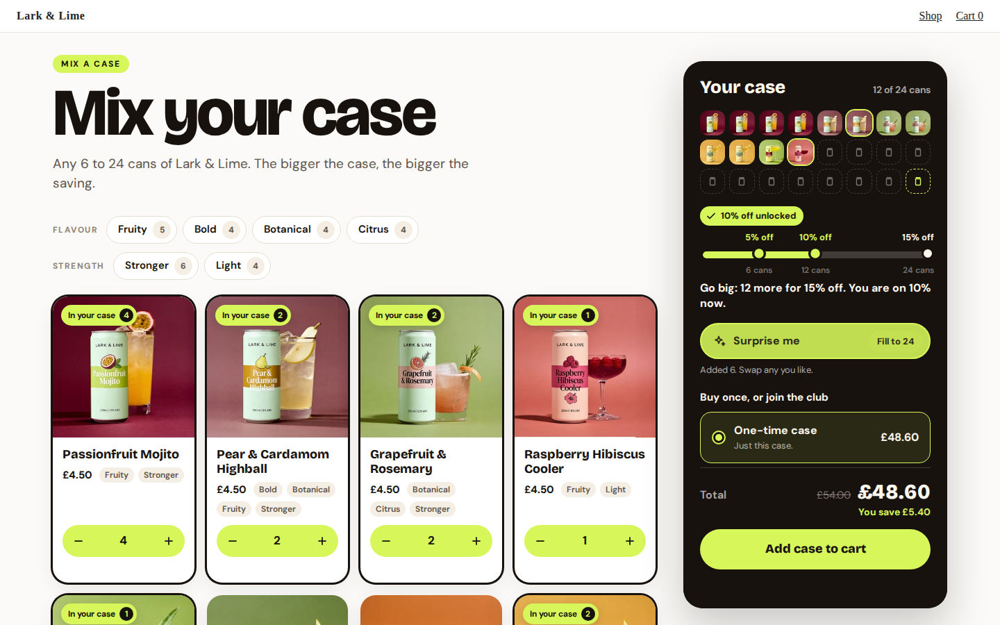
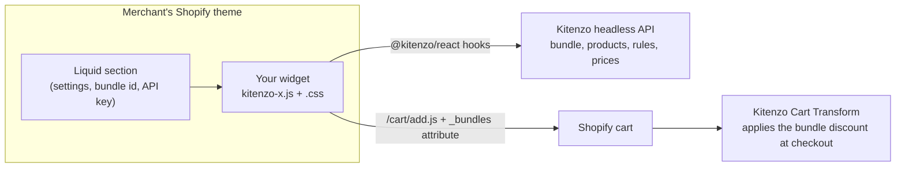

# Kitenzo custom components

**Build a bundle experience that looks nothing like a template, and let Kitenzo run the engine underneath it.**

A Kitenzo custom component is your own React (or plain TypeScript) widget, in your own design, that sells a Kitenzo bundle on a normal Shopify theme. Kitenzo's engine still does the hard parts: what can be picked, how many, what it costs, how it lands in the cart, and the discount at checkout. You own every pixel. The result ships as two theme assets and a Liquid section, edited by the merchant in the theme editor like any other section. There is no separate hosting and no headless storefront.

> **Beta.** Kitenzo Headless, which custom components run on, is invite-only and has not finished its testing. The SDK is `0.x` and may change between minor versions. To try it on your store, email support@kitenzo.com with your `myshopify.com` domain.

<table>
<tr>
<td width="25%"><a href="examples/macaron-box/"></a></td>
<td width="25%"><a href="examples/cocktail-case/"></a></td>
<td width="25%"><a href="examples/activewear-set/"></a></td>
<td width="25%"><a href="examples/skincare-routine/"></a></td>
</tr>
</table>

Four of the seven examples: one SDK, four very different interfaces, all on real products from the Kitenzo demo store.

This repo has three parts:

| | What it is | Start here if... |
|---|---|---|
| [**starter/**](starter/) | The repo you copy. A complete, generic custom component that renders any Kitenzo bundle, with a mock backend, a dev toolbar of edge-case scenarios, unit tests, an end-to-end conformance suite, a Liquid section and an install kit. | ...you are building one. |
| [**examples/**](examples/) | Seven custom components that push it further: a box you fill slot by slot, a quiz that builds a skincare routine, a cocktail case with subscribe and save, a personalised gift box, an outfit with a dense size and colour grid, a volume ladder for a product page, and one with no React at all. | ...you want to see what is possible. |
| [**guides/**](guides/) | How it works, the contract a widget keeps with the theme and the engine, the best practices, and every edge case we know about, with how to reproduce it. | ...you want to do it properly. |

And for coding agents: [AGENTS.md](AGENTS.md).

## See it in sixty seconds

```bash
git clone https://github.com/kitenzo/custom-components.git
cd custom-components/starter
bun install
bun run dev
```

Open http://localhost:5173. You are looking at a real bundle on the Kitenzo demo store's products, served by a mock of the Kitenzo API and Shopify's cart, so it runs with no store, no key and no network. Build a bundle, add it to the cart, and the cart page shows exactly what reached Shopify. The toolbar in the corner switches the widget into the situations real stores put it in: a slow API, an unpublished bundle, a cart that refuses a line, a shopper in Japan, a hostile theme.

You need [Bun](https://bun.sh) 1.3 or later.

## What a custom component can do

Anything the bundle can describe, in any design:

- **Any shape of bundle.** One step or many, a count per step or across the bundle ("pick any 6"), alternatives ("6, 12 or 24"), required products, product options, set prices, tiered discounts, conditions that hide steps or products.
- **Any interface.** A box that fills slot by slot. A quiz that picks the products. A wizard. A case with facets. A compact ladder in a product page's sidebar. A full-page configurator.
- **Shopper input that reaches the order.** Engraving, gift messages, personalisation, matched to the right bundle even with two in one basket.
- **Subscribe and save**, through Kitenzo Recurring bundles.
- **Every market.** Prices in the shopper's currency, matching checkout to the penny.
- **The cart's "Edit".** A shopper editing a bundle from the cart lands back in your widget with it rebuilt, and saving replaces it.
- **Kitenzo's A/B tests**: test your custom component against Kitenzo's own builder, or against another design, with nothing extra to build as long as you load bundles through `useBundle` and add them through the cart hook.

## How it works, briefly



The section renders a `<div>` carrying the bundle id and the merchant's settings. Your script mounts on it, loads the bundle through the SDK, lets the shopper build it, and adds it to the theme's own cart. Kitenzo's Cart Transform reads what the SDK wrote and discounts it at checkout. [guides/how-it-works.md](guides/how-it-works.md) has the detail.

## Building one with an AI agent

You do not have to write the code yourself. Point Claude Code, Codex, Cursor or any coding agent at this repo: [AGENTS.md](AGENTS.md) tells it what a custom component is, what it may and may not change, and how to prove its work. [guides/working-with-ai.md](guides/working-with-ai.md) has prompts to copy, for people who code and people who do not.

## Status and support

- SDK: [`@kitenzo/react`](https://www.npmjs.com/package/@kitenzo/react) and [`@kitenzo/core`](https://www.npmjs.com/package/@kitenzo/core), 0.10.
- API and SDK reference: https://headless.kitenzo.com
- Questions and access: support@kitenzo.com
- Where the SDK ends and the widget begins: [guides/working-with-the-sdk.md](guides/working-with-the-sdk.md)

MIT licensed. The product data in the examples is the Kitenzo demo store's.
