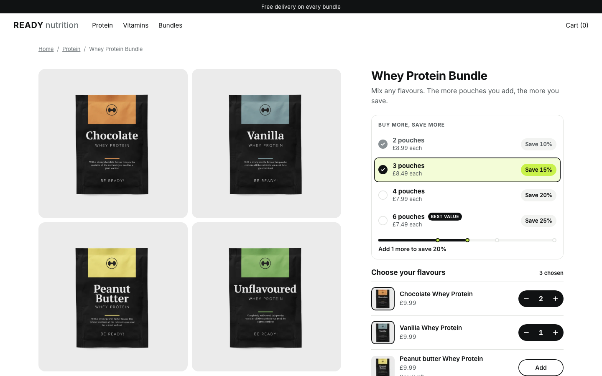

# Examples

Seven custom components, each a copy of the [starter](../starter/) taken somewhere the starter does not go. Every one runs on real products from the Kitenzo demo store, against the same mock backend, and passes the same conformance suite at desktop and mobile under a hostile theme. Each is a standalone project: copy any one of them out and it runs.

<table>
<tr>
<td width="50%"><a href="macaron-box/"></a><br><b><a href="macaron-box/">macaron-box</a></b>: choose a box, fill the tray</td>
<td width="50%"><a href="skincare-routine/"></a><br><b><a href="skincare-routine/">skincare-routine</a></b>: a quiz builds the bundle</td>
</tr>
<tr>
<td><a href="cocktail-case/"></a><br><b><a href="cocktail-case/">cocktail-case</a></b>: facets, a ladder, subscribe and save</td>
<td><a href="gift-box/"></a><br><b><a href="gift-box/">gift-box</a></b>: engraving and a message, on the right box</td>
</tr>
<tr>
<td><a href="activewear-set/"></a><br><b><a href="activewear-set/">activewear-set</a></b>: dense option grids at a set price</td>
<td><a href="volume-ladder/"></a><br><b><a href="volume-ladder/">volume-ladder</a></b>: buy more, save more, in a sidebar</td>
</tr>
<tr>
<td><a href="vanilla-core/"></a><br><b><a href="vanilla-core/">vanilla-core</a></b>: no React, 26 KB gzipped</td>
<td><a href="../starter/"></a><br><b><a href="../starter/">starter</a></b>: the generic one you copy</td>
</tr>
</table>

| Example | What it shows | Edge cases it takes on |
|---|---|---|
| [macaron-box](macaron-box/) | A box that is the interface: choose a size, fill a tray slot by slot with photographs, "fill the rest". | Several `eq` rules as alternatives (6, 12 or 24), set-price tiers, stock caps inside a box, seeded random fill. |
| [skincare-routine](skincare-routine/) | A quiz that builds the bundle, then a step-by-step wizard to adjust it. | Seeding a builder from a computed selection, `autoNextSection`, tag-driven recommendations that skip sold-out products, option dropdowns with a sold-out size. |
| [cocktail-case](cocktail-case/) | Mix a case with flavour and strength facets, a discount ladder, "Surprise me", and subscribe and save. | Facets from tag prefixes, tier progress from the bundle's own tiers and `customText`, Kitenzo Recurring bundles, the `?subscription=` reorder link. |
| [gift-box](gift-box/) | A personalised gift box whose engraving and card message reach the right box on the order. | Required personalisation, two boxes in one basket, products with no photographs, and the SDK gap for line item properties. |
| [activewear-set](activewear-set/) | Complete the set: three pieces, each a dense Size by Colour grid, at a set price. | Unavailable combinations, option order as significance order, a price known before the first pick, per-variant surcharges, variant photographs. |
| [volume-ladder](volume-ladder/) | Buy more, save more, compact enough for a product page's sidebar. | Container queries, two layouts from one asset, Shopify Markets in every amount. |
| [vanilla-core](vanilla-core/) | The same job with no React at all, on `@kitenzo/core` alone. | What the React hooks do for you, measured: bundle size, and what you must rebuild (cart phases, basket Edit, A/B testing). |

## Run one

```bash
cd examples/<name>
bun install
bun run dev        # the port is in each example's vite.config.ts
bun run verify     # typecheck, unit, the conformance suite at desktop and mobile
```

The scenario toolbar (bottom left of the dev page) works in every example: try any of them under `?scenario=market-jpy`, `?scenario=cart-422` or `?theme=hostile`.
