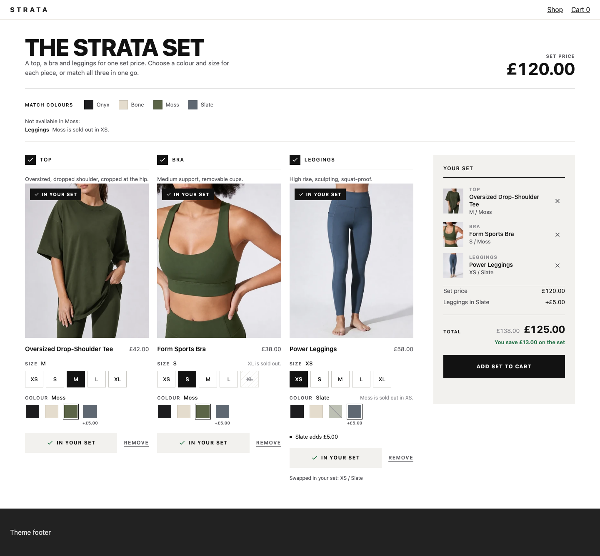
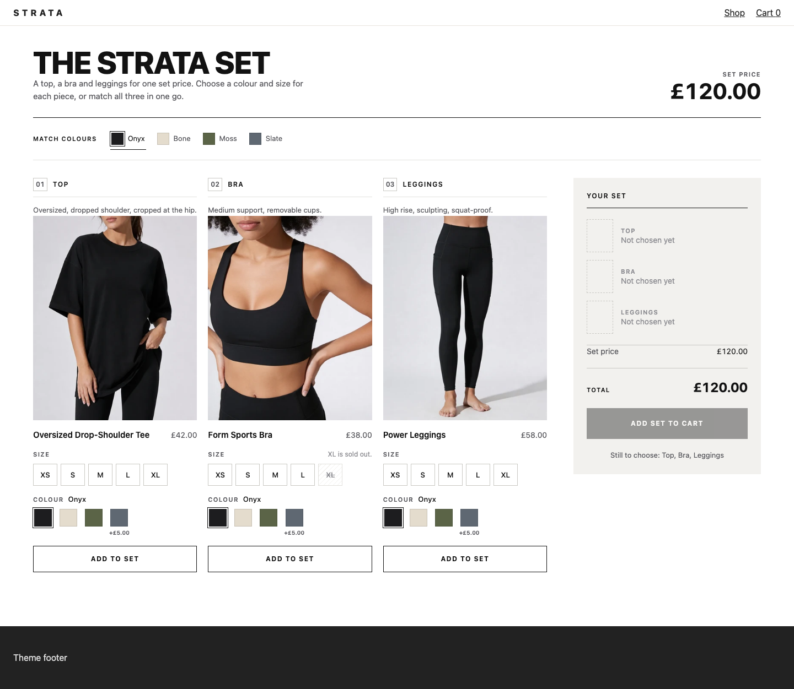
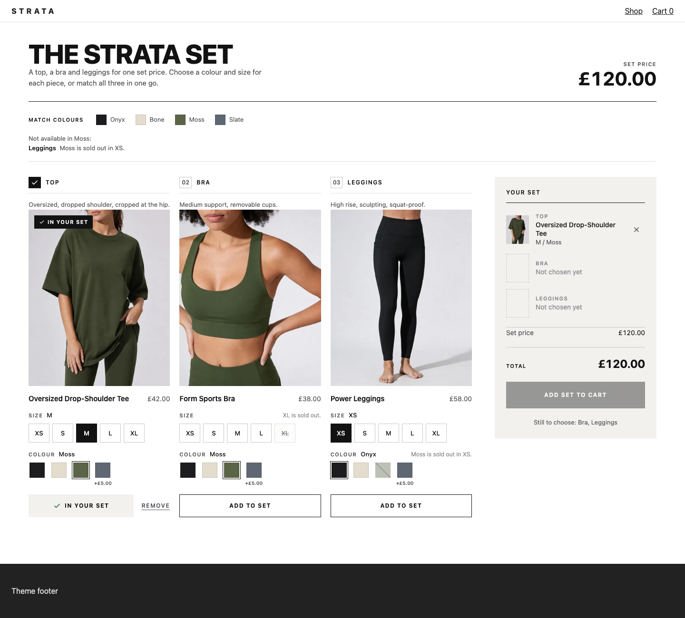
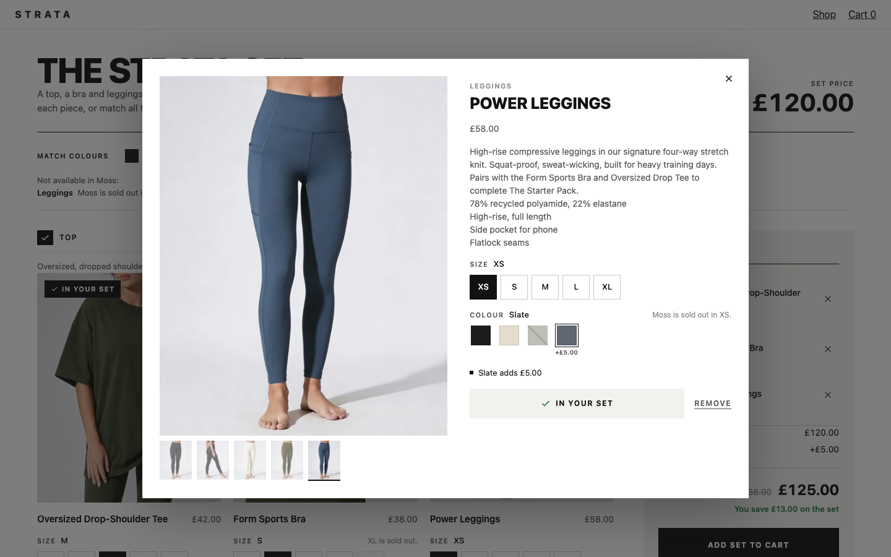
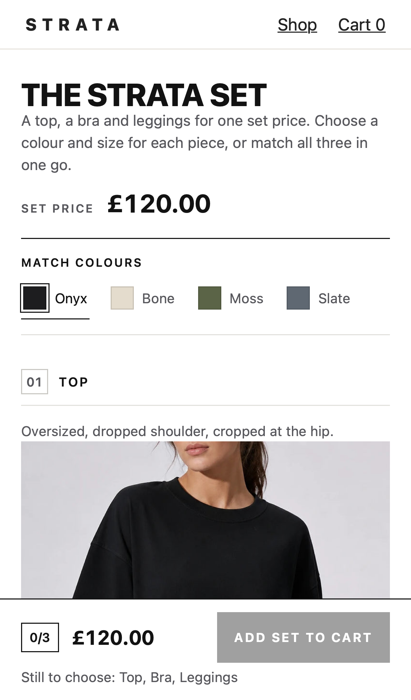

# Activewear set

**A "complete the set" outfit builder: three pieces, each with a dense Size by Colour grid, sold for one set price with a surcharge on a premium colour.**



A custom component is a React widget on the published `@kitenzo/react` SDK that renders a Kitenzo bundle in its own design and ships to a Shopify theme as two assets and a Liquid section. Kitenzo's engine owns selection, validation, pricing and the cart; this widget owns how it looks. It is a copy of [the starter](../../starter/) taken further, and keeps every rule the starter keeps.

This one shows the hard part of option UIs. Each piece (a top, a bra, leggings) has twenty variants, and some combinations are sold out. The widget:

- draws Colour as swatches and Size as buttons, and **disables an unreachable value instead of hiding it**, with the reason written beside the row ("Moss is sold out in XS.");
- follows the SDK's rule that **option order is significance order**: changing the colour never moves the size the shopper chose; a size change that rules out the colour moves the colour, and says so;
- shows the **set price from the first paint**, before anything is picked;
- moves the price when **Slate** is chosen, and explains why ("Slate adds £5.00", "Leggings in Slate +£5.00"), in the shopper's currency;
- has **Match colours**: one press puts every piece in one colour where that colour can be had, and names the pieces where it cannot;
- shows **large photographs that follow the chosen colour** (the variant's own image, falling back to the product's).

| | |
|---|---|
|  |  |
|  |  |

More: [mobile option grid](docs/screenshots/mobile-options.png), [mobile set panel](docs/screenshots/mobile-complete.png), [mobile dialog](docs/screenshots/mobile-dialog.png).

## Run it

```bash
cd examples/activewear-set
bun install
bun run dev        # http://localhost:5185
bun run verify     # typecheck, unit, build, e2e (desktop Chromium and mobile WebKit)
```

The dev page runs the real SDK against a mock of the Kitenzo API and Shopify's cart, on the STRATA products from the Kitenzo demo store. The toolbar (bottom left) turns on the edge cases below.

## The bundle shape it expects

`dev/catalog.ts` describes the demo bundle (id 2005):

- **Three steps, each "exactly 1"**: Top (`oversized-drop-tee`), Bra (`form-sports-bra`), Leggings (`power-leggings`). Each is Size (XS to XL) by Colour (Onyx, Bone, Moss, Slate).
- **A set price**: `discount.price(120)`. A flat set price is known before any pick (`resolveUpfrontFixedPrice`), so `useBundlePrice` shows it on the first paint.
- **Variant surcharges**: `applyVariantSurcharges: true` and £5 on every Slate variant. The SDK adds them after the set price.
- **Sold-out combinations**: tee S in Slate; bra L in Bone and XL in every colour; leggings XS in Moss. Leggings M in Slate has two left.

It also handles an optional piece (a step of "at most 1"), required products (listed in the set panel as included) and products with no option data (a plain variant select).

**It refuses** a step that takes more than one piece. A set needs a size and colour per piece, which this design draws once per step, so the theme editor names the step and the bundle is held off sale rather than sold half-drawn. Use the starter for that bundle. Like the starter, it also refuses required personalisation it cannot collect.

## Edge cases, and where to see them

| Case | What the widget does | See it |
|---|---|---|
| A colour sold out in the chosen size | Swatch struck through, `aria-disabled`, reason beside the row and on press | Leggings, choose XS (Moss) |
| A size sold out in every colour | Size button struck through, "XL is sold out." | Bra, XL |
| A size change that rules out the colour | The colour moves (`selectOptionValue`) and the piece says "Moss is sold out in XS, so Colour is now Onyx." | Leggings: Moss, then XS |
| Match colours where a piece cannot follow | Matches the rest, keeps that piece's size, lists it with the reason | Leggings XS, then Match Moss |
| A colour or size change on a piece already in the set | Swaps the piece in the set (the SDK's builder: remove, add), never doubles it | Add a piece, change its colour |
| Add before a size is chosen | Adds nothing; "Choose your size first." and the size row nudges | Any piece |
| Surcharge in another currency | Converted at the SDK's market rate, so the note and the total agree | `?scenario=market-eur` (Slate adds €5.85) |
| Zero-decimal currency | `?scenario=market-jpy` | |
| The last two of a combination | "Only 2 left" | Leggings, M in Slate |
| A piece sold out in everything | Shown, greyed, "Sold out", not pickable | `?scenario=all-sold-out` |
| Hidden sold-out products | Kept when hiding would leave a step unfillable | `?scenario=hide-sold-out` |
| Archived and draft products | `?scenario=archived-and-draft` | |
| The theme editor | Problems explained to the merchant | `?scenario=theme-editor` |
| Slow, failing or missing API, cart refusals, hostile strings, two sections, a hostile theme | As the starter | the toolbar |
| Basket Edit | Restores each piece in its saved size and colour, at creation | add to cart, then **Edit** on the cart page |

## How it works

```
src/
  options.ts        the option grid: swatches and their colours, why a value is out of reach,
                    the photograph for a choice, surcharges, and the Match colours plan (pure, unit tested)
  money.ts          every amount; the set price and surcharges converted at the SDK's market rate
  model.ts          what is offered; refuses steps that take more than one piece
  selection.ts      the SDK's builder, plus pickOf / swapBlocked for changing a piece in the set
  ui/usePieces.ts   every piece's size and colour, held once, seeded at creation; swaps a piece in the set
  ui/usePiece.ts    one piece: resolve, add, remove, and the sentence for every "no"
  ui/PickControls.tsx  swatches, size buttons, the add control
  ui/PieceCard.tsx  a piece: photograph that follows the colour, options, surcharge note
  ui/Builder.tsx    the steps, Match colours, status
  ui/Summary.tsx    "Your set": pieces, set price, surcharge lines, total, buy button
```

The option rules are the SDK's: `reachableOptionValues` decides what is offered (only the options before it constrain a value) and `selectOptionValue` applies a change (only the options after it are repaired). `options.ts` adds what a UI needs on top: the reason for each withheld value, and the list of repairs so the widget can announce them. Prices come from `useBundlePrice`; the set panel's lines (set price, each surcharge) explain that total and never compute a different one.

**Swatch colours** come from the section setting "Swatch colours" (`Onyx: #1d1d1f`, one per line), then Shopify's native swatch for the value (`ProductOption.swatches`) when the API sends one, then the value itself if it is a colour word, then a photograph of the product in that value. Which options are swatches is a setting too ("Colour, Color" by default); an option with Shopify swatches always is.

Tests: `test/options.test.ts` (the grid, swatches, surcharges, Match colours), `test/selection.test.ts`, `test/model.test.ts`, and `e2e/activewear-set.spec.ts` beside the conformance suite, including the check that changing the colour never moves a chosen size.
