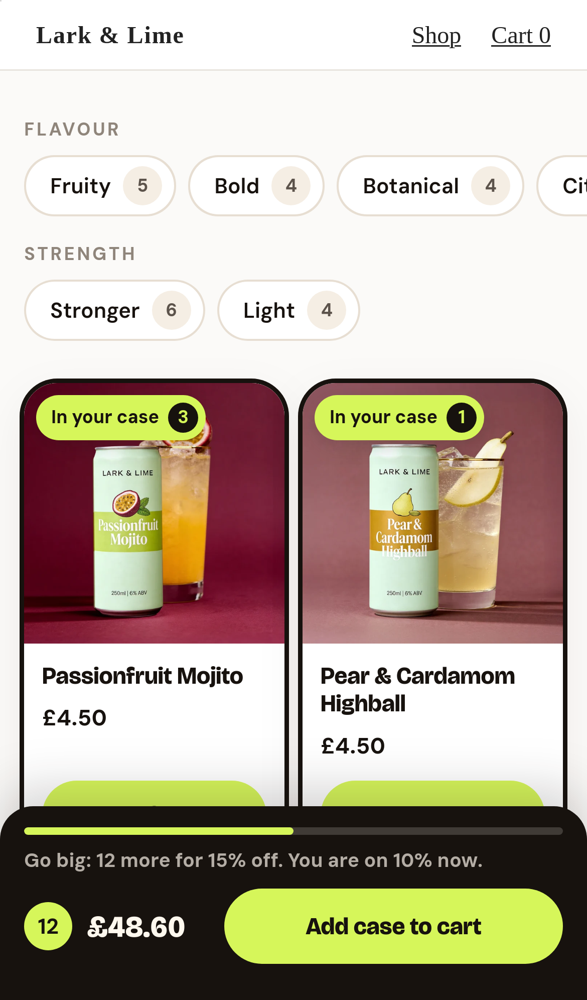
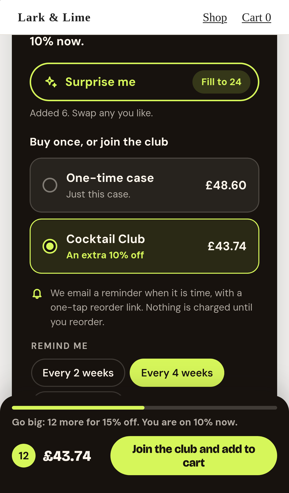
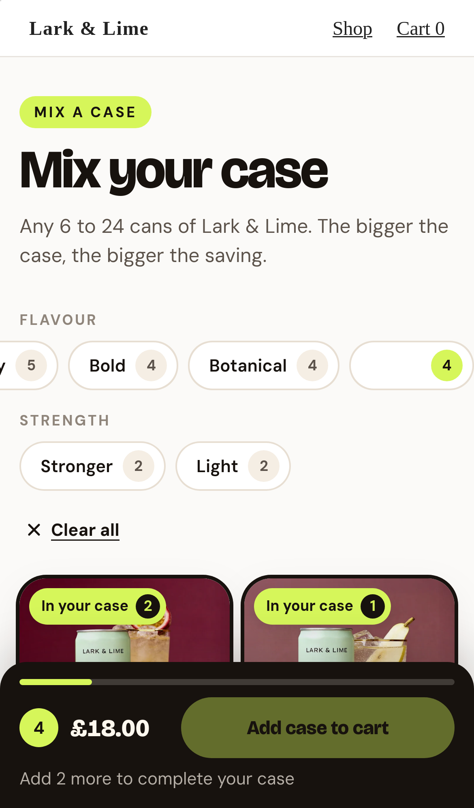

# Cocktail Case

A mix-a-case builder for canned cocktails: filter by flavour and strength, watch a discount ladder say what the next tier is worth, let "Surprise me" fill the rest, and join a club that reminds you to reorder.


<p>
  
  
  
</p>

It is a [Kitenzo](https://kitenzo.com) custom component: a React widget on the published `@kitenzo/react` SDK that ships to a Shopify theme as one JS file, one CSS file and a Liquid section. Kitenzo's engine owns selection, validation, pricing and the cart; this widget owns how the case looks and feels.

## What it shows

- **Filters made from tags.** Every product tag that starts with a prefix the merchant names in the theme editor (`Flavor_ = Flavour`, `Strength_ = Strength`) becomes a chip in that facet. Chips within a facet are alternatives (Fruity or Citrus), facets narrow each other (Fruity and Light), and each chip's count is what you would see if you pressed it. A can already in the case is never filtered away: it stays in the grid, marked "In your case", so its minus button is still there. Tags without a listed prefix (the store also carries plain `Fruity`, `Light`) make no chips.
- **A discount ladder read from the bundle.** The rungs, the fill and the message come from the bundle's tiered discount through the SDK (`getDiscountLadder`, `getDiscountLadderProgress`, `getDiscountTierText`), never from the code, so the ladder cannot promise a discount checkout will not give. The message follows Kitenzo's own builder: the next tier's `customText` speaks when the merchant wrote one (with `{{ amount }}`, `{{ discount }}` and `{{ currentDiscount }}` filled), the theme's default copy when they did not, and the theme's "top tier" copy at the top. The price itself is always the SDK's (`useBundlePrice`).
- **"Surprise me".** Fills the case to the next size worth stopping at (the minimum, the next rung, or the maximum; or the next allowed size when the rules are "6, 12 or 24"), with a seeded generator that leans toward the active filters and mixes the cans. The size is one the rules accept: short of one, it is the SDK's own next acceptable count (`progress.missing`), and a rung or maximum that is not a whole pack ("sold in packs of 6") is never a stop. Whether a can fits is the SDK's answer: the draw offers each can to a builder of its own (`createBundleBuilder`, holding the shopper's case) and keeps what that builder takes, so never a sold-out can, one past its stock, or one over a limit on a single product. The plan is pure and tested; it is applied through the page's builder like any other pick.
- **Subscribe and save with Kitenzo Recurring bundles.** `useRecurringPlan` holds the plan, cadence and email; `useBundlePrice(…, { recurring: plan.choice })` prices it; `addToCart(bundle, selections, { recurring })` sends it to `/configure` and onto every cart line. The email is checked (`plan.errors`, each reason worded by a theme setting through the SDK's `messages` option) before anything is sent, and the copy promises a reminder to reorder, not a charge, because that is what Recurring bundles do. Never Shopify selling plans.
- **The reorder link.** A reminder email links back with `?subscription=<id>`. The widget reads it (`readRecurringSubscriptionId`), loads the bundle with it (`useBundle(id, { subscriptionId })`), and the add becomes a reorder at the member price. A link the API no longer recognises says so and sells a one-time case.
- **The case as a crate.** One slot per can up to the maximum, filled in the order the cans went in, with the slots that complete a tier ringed in the accent. A filled slot is a button that takes that can back out.

## The bundle it expects

One step, a count across the whole bundle, and a tiered discount on the number of products. Optionally a Recurring bundles plan, and tags with prefixes for the filters. The demo bundle (`dev/catalog.ts`, id 2003):

| | |
|---|---|
| Step | "Pick your cans": ten Lark & Lime canned cocktails (real products and photographs from the Kitenzo demo store) |
| Count rules | bundle-wide (`sectionId: null`): at least 6, at most 24 |
| Discount | tiered percentage on total products, operator `max`: 6+ 5%, 12+ 10% (with `customText`), 24+ 15% (with `customText`) |
| Recurring | "Cocktail Club": every 2, 4 or 8 weeks, 10% off, applied to the first order too |
| Tags | `Flavor_Fruity`, `Flavor_Citrus`, `Flavor_Bold`, `Flavor_Botanical`, `Strength_Light`, `Strength_Stronger`, and unprefixed copies |
| Stock | Watermelon Basil Spritz is sold out on the store; Spicy Pineapple Margarita has 4 left |

Other shapes it handles, by leaving out what the bundle does not have:

- **No tiers** (a flat discount, or none): no ladder; "Surprise me" fills to the minimum, then the maximum.
- **Tiers that are not a rung on the ladder** (on spend, on one product's quantity, above the bundle's maximum, or worth nothing): still priced by the SDK; the theme editor names each tier the ladder leaves out, one sentence per tier (`ladderNotes`).
- **"Exactly 6, 12 or 24"** (several `eq` rules) and **"sold in packs of 6"** (a `multiples-of` rule): the status counts to the next size, and "Surprise me" only fills to sizes the rules accept.
- **Conditions that hide a step or a can:** what the conditions engine hides leaves the page, the filter counts and "Surprise me" together, because all three read the same offer.
- **A limit on one product or one variant** ("at most 2 of each"): the third can is refused with its own sentence, and "Surprise me" keeps to it.
- **No recurring plan:** no plan picker. **No tags with a listed prefix**, or filters turned off: no chips.
- **Several steps** render as several grids under one set of filters. **Required products** take the first slots of the case.

It refuses (a sentence for the shopper, the reason for the merchant in the theme editor) what every Kitenzo custom component refuses: rules that contradict each other, a step with a minimum and nothing in stock, a sold-out required product, and required personalisation it cannot collect.

## Edge cases, and where to see them

Run the dev server and add `?scenario=<id>` (comma-separate several), or use the dev toolbar.

| Edge case | How to see it |
|---|---|
| Ladder copy: theme default, then the tier's own `customText`, then the top | default: add 1, then 7, then 12, then 24 cans |
| A can in the case stays visible outside the filters | add a Pear & Cardamom, then press "Light" |
| Chip counts follow the other facets | press "Citrus": Strength reads 2 and 2 |
| "Surprise me" skips sold-out and capped cans | default (Watermelon is sold out); add 4 Spicy Pineapple, then press it until the case is full |
| Subscribe needs an email, checked before anything is sent | choose "Cocktail Club" and press the buy button with no email |
| A reminder's reorder link | `/?subscription=sub_demo_club` (served by `dev/reorder.ts`) |
| An expired reorder link | `/?subscription=sub_anything_else` |
| A can with little stock says how many are left, stops at its stock and says why | default (Spicy Pineapple, 4 left; "Low stock from" in the section's settings moves the threshold, 0 never says it); `?scenario=low-stock` |
| A sold-out can is shown and unpickable, or hidden | default; `?scenario=hide-sold-out` |
| Prices in the shopper's currency | `?scenario=market-eur`, `?scenario=market-jpy` |
| Cart refusals as sentences | `?scenario=cart-422`, `cart-429`, `cart-500`, `cart-offline` |
| Basket Edit reopens the case | add a case, then use the "Edit bundle" link on `/cart` |
| Bundle unpublished, API down, slow, never answers | `bundle-404`, `api-500`, `api-offline`, `slow-api`, `loading-forever` |
| Archived and draft products, hostile strings, contradictory rules, an empty bundle, a draft bundle | `archived-and-draft`, `hostile-strings`, `contradictory-rules`, `empty-bundle`, `draft-bundle` |
| The theme editor's explanations | add `theme-editor` to any of the above |
| A hostile theme | `?theme=hostile`; the e2e suite runs every test under it |

## Run it

```bash
bun install
bun run dev                          # http://localhost:5183 (the port is in vite.config.ts)
bun run verify                       # typecheck, unit tests, theme asset build, e2e (desktop Chromium, iPhone 14 WebKit)
bun run screenshots                  # regenerate docs/screenshots (dev server running)
bun run package:embed                # the zip a merchant installs: assets, section, install guide
```

Install on a store with `theme/README.md` (the install guide) and `MERCHANT-SETUP.md` (what to set up in Kitenzo).

## How it works

- `src/model.ts`: `toViewModel(bundle, settings, conditions)` turns the SDK's offer (`getBundleOffer`) into the steps, cans and merchant problems the page draws. What the conditions engine hides is already gone from it.
- `src/selection.ts`: reads the builder's `progress`: what is still owed (`missingPicks`), and when a step is done or finished (`isStepDone`, `isStepFinished`).
- `src/facets.ts`: the filters as pure functions. `parseFacetDefs` reads the theme setting; `indexFacets` reads every product's tags once; `facetGroups` builds the chips and their counts from that index; `applyFacets` decides what the grid shows (matches, plus everything in the case).
- `src/tiers.ts`: `readLadder` takes the rungs and where the case stands on them from the SDK; `discountLabel` words a discount from the theme's copy; `ladderMessage` picks whose words speak (the tier's `customText`, filled by the SDK, or the theme's); `ladderNotes` tells the merchant about each tier the ladder leaves out.
- `src/surprise.ts`: `nextCaseSize`, `surpriseCandidates` (what may be drawn, and how much each weighs) and `planSurprise` (the seeded draw, on a builder of its own that takes only what fits).
- `src/recurring.ts`: the theme's sentence for each reason the SDK refuses a plan (`planMessages`, keyed by the error's `code`), its wording of a cadence, and the cart line's visible property names.
- `src/content.ts`: the merchant's settings (copy, the facets, and when stock reads as low), read defensively, with the same defaults as the section.
- `src/App.tsx`: reads `?subscription=`, loads the bundle with it, and waits for the shop's settings and the cart's Edit. `src/ui/Builder.tsx`: owns the SDK builder and the model, the filters, the buy gate (`isSatisfied` and no plan problem) and the add with `{ recurring }`.
- `src/ui/context.ts`: two contexts. `useBuilder()` is what stays the same while the shopper picks (the model, the copy, the facets, the builder's methods); `useSelection()` is the builder's snapshot (the picks, `progress`, the ladder). Cards are memoised, so a render that changes neither (the nudge, the dialog, a letter typed into the club's email field) draws no card again. The plan is handed down the case rail as a prop for the same reason.
- `src/ui/copy.ts`: `blockedText`, a sentence of the merchant's for every reason the SDK refuses one more can.
- `src/ui/FacetBar.tsx`, `src/ui/Ladder.tsx` (ladder and "Surprise me"), `src/ui/PlanPicker.tsx`, `src/ui/Summary.tsx` (the case, the price, the sticky bar), `src/ui/ProductCard.tsx`, `src/ui/usePick.ts` (one product's picker, shared by the card and the dialog).
- `dev/catalog.ts`: the demo bundle. `dev/reorder.ts`: answers the demo reorder link, because the shared mock backend ignores `?subscription=`. `theme/kitenzo-cocktail-case.liquid`: the section, with every visible string a setting, and the one number the bundle does not carry (**Low stock from**, 5 by default).
- `test/facets.test.ts`, `test/tiers.test.ts`, `test/surprise.test.ts`, `test/recurring.test.ts`, `test/model.test.ts`, `test/selection.test.ts`, `test/copy.test.ts`: the widget's own logic. `test/sdk-contract.test.ts`: the few SDK behaviours the widget has no fallback for. `test/theme.test.ts`: the section and `src/content.ts` agree. `e2e/cocktail-case.spec.ts`: this example's behaviour, including what `/configure` and the cart lines carry for a new plan and a reorder; `e2e/conformance.spec.ts`: what every Kitenzo custom component must do, on the built asset.

Everything else (config, the mount registry, the mock backend) is the starter's, unchanged in purpose; its comments explain the rules each part keeps.
