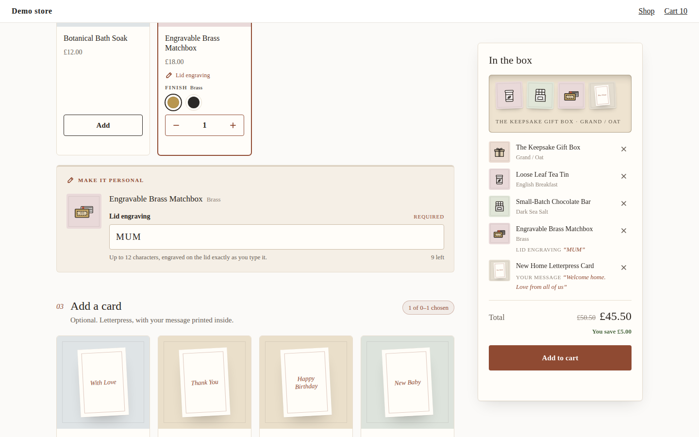

# Gift Box

A gift box builder whose personalisation (an engraving, a card message) reaches the merchant's order intact, on the line of the product it belongs to, even with two gift boxes in one basket.


| Phone (iPhone 14) | What the merchant receives: two boxes, each with its own engraving and message |
|---|---|
|  |  |

It shows three things:

- **Shopper input that reaches the order.** The bundle defines personalisation fields per product (a required 12-character engraving on the brass matchbox, an optional 200-character message in every card). The widget renders them and hands the answers to the SDK's cart (`addToCart(bundle, selections, { properties })`), which writes each one as a line item property on that product's own cart line, named by the field's frozen `key`. Every line of one box shares the SDK's `_bundle_data`, so an order with two gift boxes reads as two groups of lines, each with its own engraving and message. A gift message sent anywhere else (a cart note, a separate line, a cart attribute) cannot be matched to its box when the order is packed.
- **A buy button that says what is missing.** The SDK decides whether the box is complete (`isSatisfied`), which required answers are missing (`missingPersonalisation`, the check its own cart refuses an add on) and which answers are over their character limit (`personalisationFieldProblems`). The widget words the finding in the merchant's sentences and says which field is in the way: "Add “Lid engraving” for the Engravable Brass Matchbox". Pressing it anyway scrolls to the field and focuses it.
- **No photographs, and still finished.** The demo products have no images at all, as many new shops do at launch. Each product gets a drawn tile instead (see "No images" below), and a box preview in the summary draws the box in the colour the shopper picked, with what is going into it.

## The bundle it expects

The demo bundle (`dev/catalog.ts`, bundle 2004) is Wrenwood Gifting Co.'s gift box, on the Kitenzo demo store's real products:

- **Choose your box** (`eq 1`): the Keepsake Gift Box, Size (Petite, Classic, Grand) by Colour (Oat, Terracotta). Grand / Terracotta is sold out, so the option grid has to work out what is reachable.
- **Fill it** (2 to 5): a candle (Scent), a tea tin (Blend), a chocolate bar (Flavour, 3 left), socks (Colour), a bath soak, and the engravable brass matchbox (Finish).
- **Add a card** (at most 1, optional): six letterpress cards, one sold out.
- A flat £5 off.
- Personalisation: the matchbox has a required text field (key `Engraving`, label "Lid engraving", 12 characters); every card has an optional one (key `Card message`, label "Your message", 200 characters). The key and the label differ on purpose, so a test can tell which one reached the cart.

What it accepts, and how:

| Bundle shape | What the widget does |
|---|---|
| Text personalisation fields, required or optional | An input (40 characters or fewer) or a ruled textarea, with the field's own label, placeholder, help text and limit, and a live character count. |
| Dropdown and checkbox fields | A select of the field's options, or a checkbox sent as "Yes". |
| Fields on a required product | Shown after the steps: the product is in every box, so its fields always apply. |
| A field with a fee | The fee is shown beside the field ("Adds £4.00"). Once the field is filled in, the SDK adds it to the total (shown on a line of its own above it) and to the cart as the fee's own line. |
| An optional `image` field | Left out, with a note to the merchant in the theme editor. |
| A **required** `image` field | Refused: the bundle is held off sale, and the theme editor says which field and why. The SDK takes an image as the web address it is hosted at, and this design has no upload to host it; the SDK will not add a bundle with a required field unanswered. |
| A single-product or multiple-products bundle | No fields are shown. Only a native bundle's lines can carry an answer, so the SDK asks for none on the other types and neither does the widget. |
| A step with one product | Drawn as a featured panel with its options as buttons (the box). |
| A step that holds one (`eq 1`, `max 1`) | Choosing another replaces the choice ("Swap to this", the SDK's `swapItem`), like radio buttons, instead of "this step is full". Whether the replacement can go in is the SDK's answer for the swap (`swapBlockedReason`), so under "one of each product" the chosen box still swaps to another size of itself. |
| Low stock | A product with the merchant's **Low stock from** or fewer left says "Only 3 left" (5 by default, 0 to never say it). |
| Any other shape | As the starter: any number of steps, per-step and bundle-wide counts, required products, options, sold-out and capped stock, conditions. |

One answer per product per box. Kitenzo defines personalisation per product, so two of the same matchbox in one box (or one Brass and one Matte Black) share an engraving.

Characters are counted the way the SDK counts them against the limit (`String.length`, after trimming, so an emoji is two), so the counter can never show room for an answer the SDK finds too long. Left alone, the SDK cuts an answer over its limit on the way to the cart. An engraving is never cut here: the widget asks `personalisationFieldProblems` first, and while it reports an answer as `too-long` the buy button waits and says by how much to shorten it, the number being the SDK's `over`.

## No images

A product with a photograph shows the photograph. One without gets a tile drawn from data it already has (`src/ui/art.ts`, `src/ui/ProductArt.tsx`):

- a line drawing of what it is, recognised from its title and then its tags: box, candle, tea, chocolate, socks, bath, matchbox, card. A card shows its greeting on its front ("With Love Letterpress Card" is a card that says *With Love*);
- a typeset initial when nothing matches (hostile titles included: markup and quotes are skipped);
- a paper tone from a stable hash of the handle, so a product is the same colour on every visit;
- the colour the shopper picked, when the product has a Colour, Finish or Shade option. Choosing Terracotta paints the box; choosing Forest paints the socks.

The drawings are inline SVG with hairline strokes that stay the same weight from a 44px summary thumbnail to the 560px dialog. No image is requested at all (an e2e test checks).

## Edge cases, and the scenario that shows each

Run the dev server and add `?scenario=<id>` (several, comma separated), or use the toolbar in the corner.

| Scenario | What you should see |
|---|---|
| (none) | Nothing chosen. Choose a box, fill it, add the matchbox: the engraving field appears under it and the buy button asks for it. |
| `market-eur`, `market-jpy` | Every amount in EUR or JPY (no decimals in JPY). No £ anywhere. |
| `low-stock` | The box has 2 left, and says so. The chocolate bar always has 3 left: set **Low stock from** below that and it stops saying it. |
| `all-sold-out` | Every product shown and unpickable, the buy button explains. |
| `hide-sold-out` | The sold-out card disappears; the sold-out box combination stays in the option grid, marked. |
| `archived-and-draft` | The archived candle is never offered; the draft tea tin follows the shop's setting. |
| `hostile-strings` | Quotes, markup, right-to-left and very long titles render as text; the drawings fall back to tags, then to initials. |
| `contradictory-rules`, `empty-bundle` | The theme editor says what to fix; the storefront shows one neutral line. |
| `slow-api`, `loading-forever` | A loading state inside the widget. |
| `bundle-404`, `api-500`, `api-offline` | "Not available" for an unpublished bundle, "please refresh" only for our own failures. |
| `cart-422`, `cart-429`, `cart-500`, `cart-offline` | The cart's reason as a sentence. After a dropped connection the selection and the typed answers are held until the next press finishes the same add. |
| `theme-editor`, `draft-bundle` | Merchant-facing explanations; a draft previews but cannot be added. |
| `?bundle=2005` | The same box where engraving costs £4. "Adds £4.00" beside the field; once it is filled in, a "Personalisation" line above the total; in the cart, an "Engraving" line of its own at £4.00. |
| `?edit=…` (from the dev cart page) | Basket Edit: the box comes back with its engraving and message already in their fields (below). |

Image uploads are not a scenario: `test/model.test.ts` covers a required and an optional image field. The fee is a bundle of its own rather than a scenario, declared on the engraving field in `dev/catalog.ts`, so the default bundle stays as the screenshots show it; `test/personalisation.test.ts` and `e2e/gift-box.spec.ts` run against it.

### Basket Edit

The cart's Edit link opens the widget with the box restored and what was typed for it already in the form. `useBundleEdit` returns both: `selections`, and `properties`, the answers the box was added with, which the SDK keeps on the cart in a hidden attribute (`_kitenzo_properties`) keyed by the box's instance, so two boxes in one cart each bring back their own. The widget turns them into form answers with `propertiesToPersonalisationValues`, which checks each against the field as it is today: an answer the merchant's field would not accept any more (a dropdown option since removed) opens blank. The add then replaces the original box, answers, fee line and all, and the record with it: once the original's lines are out of the cart the SDK drops its entry, so the record holds the box as it is and nothing of the one it replaced.



## Run it

```bash
bun install
bun run dev        # http://localhost:5184
bun run verify     # typecheck, unit, build, e2e on desktop Chromium and mobile WebKit
bun run screenshots  # regenerate docs/screenshots (dev server running)
```

Add a box to the cart and open the cart page: it lists every line with its properties, which is what reaches the order. Add a second box and both sit side by side, each with its own engraving.

## How it works

The route into the order is the whole example, and it is the SDK's. The widget keeps the form and hands the answers over:

```
src/personalisation.ts   which fields the form can draw, the answers as typed, what the SDK finds
                         wrong with them (fieldIssues), and the two conversions: answers to the
                         SDK's `properties` (lineProperties) and a box's stored properties back to
                         answers (answersFromProperties)
src/ui/Builder.tsx       the builder (useBundleBuilder), answers state (pre-filled on a basket
                         Edit), the buy gate (isSatisfied AND no field issues),
                         addToCart(bundle, selections, { properties })
src/ui/context.ts        three contexts, so a card is drawn again only when its answer can have
                         changed: what stays the same while the shopper picks (useBuilder), the
                         builder's snapshot (useSelection), and what was typed (useAnswers), which
                         only the form, the summary and the price read
src/ui/Personalise.tsx   the inputs, under the step the product was chosen in, with any fee
src/ui/Summary.tsx       the box preview, the list with what was written for each item, and the
                         total with its fee line (useBundlePrice with the same properties)
src/ui/ProductArt.tsx    photographs, or drawn tiles (src/ui/art.ts decides which drawing)
src/ui/usePick.ts        one product's picker; a step that holds one swaps instead of refusing
src/ui/copy.ts           the merchant's sentence for each reason the SDK refuses a pick
src/selection.ts         what is still owed, when a step is done or finished (from the SDK's
                         `progress`), and what choosing does in a step that holds one (choiceFor)
src/model.ts             what is offered (getBundleOffer, with what the conditions engine hides
                         left out), each product's fields, and the image fields that hold the
                         bundle off sale
src/content.ts           the merchant's settings (copy, and when stock reads as low)
```

Everything else is the SDK's: which answer goes on which line and under which key, the fee lines, refusing an add with a required answer missing, the record an Edit reads back and what it holds, the configure call, the `/cart/add.js` lines and their `_bundle_data`, the `_bundles` merge, the Edit replacement, the retry after a dropped connection, the shopper-safe error messages. Every answer typed is handed over, including one for a matchbox the shopper took back out: the SDK puts an answer only on a line of its product, charges a fee only for a unit that carries one, and keeps in its record (which Shopify copies to the order) only what landed on a line.

Tests that matter here: `test/personalisation.test.ts` (keys not labels, the too-long finding agreeing with the SDK's cut, two adds through the SDK's `createBundleCartFlow` into the mock cart, the refusal before any request, an answer for a product taken back out reaching no line, fee or record, the Edit read-back, the record after an Edit holding the new box only, the fee line) and `e2e/gift-box.spec.ts` (two different gift boxes in one cart, each box's engraving and message on that box's lines; the buy button gate; field definitions read from the bundle; basket Edit with the answers restored and the replaced box gone from the cart's record; a field with a fee; swapping, also to another size of the chosen box under a per-product limit; a per-product limit; the option grid; no images). `test/selection.test.ts` covers the swap's question (`choiceFor`) and the step marks, and `test/sdk-contract.test.ts` holds the few SDK behaviours the widget has no fallback for.

Start from [the starter](../../starter/) for everything this example shares with every component, and [best practices](../../guides/best-practices.md) rule 28 for why the route matters.
