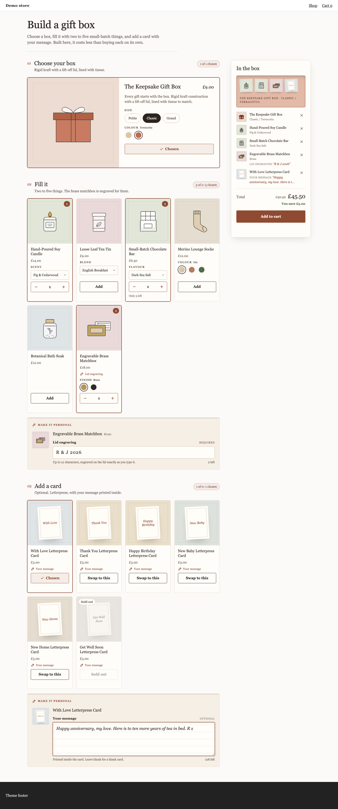
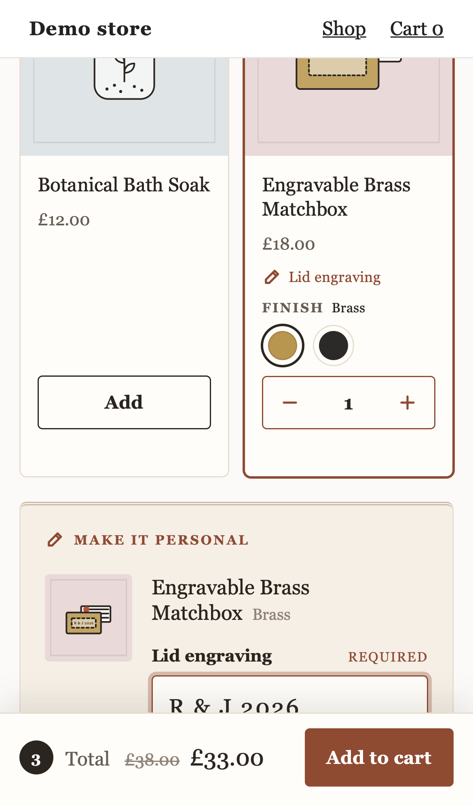
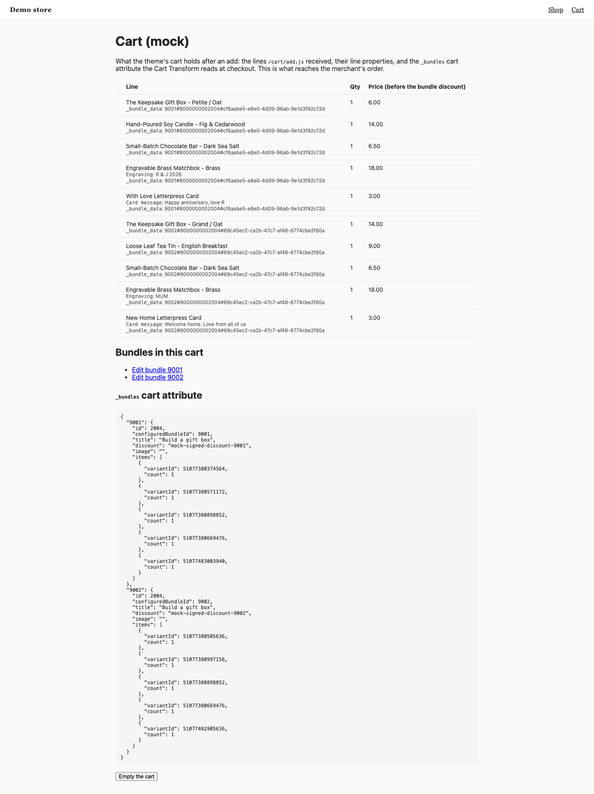

# Gift Box

A gift box builder whose personalisation (an engraving, a card message) reaches the merchant's order intact, on the line of the product it belongs to, even with two gift boxes in one basket.



| Phone (iPhone 14) | What the merchant receives: two boxes, each with its own engraving and message |
|---|---|
|  |  |

It shows three things:

- **Shopper input that reaches the order.** The bundle defines personalisation fields per product (a required 12-character engraving on the brass matchbox, an optional 200-character message in every card). The widget renders them, checks them, and sends each answer as a line item property on that product's own cart line, named by the field's frozen `key`. Every line of one box shares the SDK's `_bundle_data`, so an order with two gift boxes reads as two groups of lines, each with its own engraving and message. A gift message sent anywhere else (a cart note, a separate line, a cart attribute) cannot be matched to its box when the order is packed.
- **A buy button that says what is missing.** The SDK decides whether the box is complete (`isSatisfied`). The widget adds one more condition, every required answer filled in and within its limit, and says which one is not: "Add “Lid engraving” for the Engravable Brass Matchbox". Pressing it anyway scrolls to the field and focuses it.
- **No photographs, and still finished.** The demo products have no images at all, as many new shops do at launch. Each product gets a drawn tile instead (see "No images" below), and a box preview in the summary draws the box in the colour the shopper picked, with what is going into it.

## The bundle it expects

The demo bundle (`dev/catalog.ts`, bundle 2004) is Wrenwood Gifting Co.'s gift box, on the Kitenzo demo store's real products:

- **Choose your box** (`eq 1`): the Keepsake Gift Box, Size (Petite, Classic, Grand) by Colour (Oat, Terracotta). Grand / Terracotta is sold out, so the option grid has to work out what is reachable.
- **Fill it** (2 to 5): a candle (Scent), a tea tin (Blend), a chocolate bar (Flavour, 3 left), socks (Colour), a bath soak, and the engravable brass matchbox (Finish).
- **Add a card** (at most 1, optional): six letterpress cards, one sold out.
- A flat £5 off.
- Personalisation: the matchbox has a required text field (key `Engraving`, label "Lid engraving", 12 characters); every card has an optional one (key `Card message`, label "Your message", 200 characters). The key and the label differ on purpose, so a test can tell which one reached the cart.

What it accepts, and how:

| Bundle shape | What the widget does |
|---|---|
| Text personalisation fields, required or optional | An input (12 characters or fewer) or a ruled textarea, with the field's own label, placeholder, help text and limit, and a live character count. |
| Dropdown and checkbox fields | A select of the field's options, or a checkbox sent as "Yes". |
| Fields on a required product | Shown after the steps: the product is in every box, so its fields always apply. |
| An optional `image` field, or an optional field with a fee | Left out, with a note to the merchant in the theme editor. |
| A **required** `image` field, or a required field with a fee | Refused: the bundle is held off sale, and the theme editor says which field and why. An image needs hosting and a fee needs its own cart line; neither is in the SDK, and either done halfway sells an engraving for nothing. |
| A step with one product | Drawn as a featured panel with its options as buttons (the box). |
| A step that holds one (`eq 1`, `max 1`) | Choosing another replaces the choice ("Swap to this"), like radio buttons, instead of "this step is full". |
| Any other shape | As the starter: any number of steps, per-step and bundle-wide counts, required products, options, sold-out and capped stock, conditions. |

One answer per product per box. Kitenzo defines personalisation per product, so two of the same matchbox in one box (or one Brass and one Matte Black) share an engraving.

## No images

A product with a photograph shows the photograph. One without gets a tile drawn from data it already has (`src/ui/art.ts`, `src/ui/ProductArt.tsx`):

- a line drawing of what it is, recognised from its title and then its tags: box, candle, tea, chocolate, socks, bath, matchbox, card. A card shows its greeting on its front ("With Love Letterpress Card" is a card that says *With Love*);
- a typeset initial when nothing matches (hostile titles included: markup and quotes are skipped);
- a paper tone from a stable hash of the handle, so a product is the same colour on every visit;
- the colour the shopper picked, when the product has a Colour, Finish or Shade option. Choosing Terracotta paints the box; choosing Forest paints the socks.

The drawings are inline SVG with hairline strokes that stay the same weight from a 44px summary thumbnail to the 560px dialog. No image is requested at all (an e2e test checks).

## Edge cases, and the scenario that shows each

Run the dev server and add `?scenario=<id>` (several, comma separated), or use the toolbar in the corner.

| Scenario | What you should see |
|---|---|
| (none) | Nothing chosen. Choose a box, fill it, add the matchbox: the engraving field appears under it and the buy button asks for it. |
| `market-eur`, `market-jpy` | Every amount in EUR or JPY (no decimals in JPY). No £ anywhere. |
| `low-stock` | The box has 2 left, and says so. |
| `all-sold-out` | Every product shown and unpickable, the buy button explains. |
| `hide-sold-out` | The sold-out card disappears; the sold-out box combination stays in the option grid, marked. |
| `archived-and-draft` | The archived candle is never offered; the draft tea tin follows the shop's setting. |
| `hostile-strings` | Quotes, markup, right-to-left and very long titles render as text; the drawings fall back to tags, then to initials. |
| `contradictory-rules`, `empty-bundle` | The theme editor says what to fix; the storefront shows one neutral line. |
| `slow-api`, `loading-forever` | A loading state inside the widget. |
| `bundle-404`, `api-500`, `api-offline` | "Not available" for an unpublished bundle, "please refresh" only for our own failures. |
| `cart-422`, `cart-429`, `cart-500`, `cart-offline` | The cart's reason as a sentence. After a dropped connection the selection and the typed answers are held until the next press finishes the same add. |
| `theme-editor`, `draft-bundle` | Merchant-facing explanations; a draft previews but cannot be added. |
| `?edit=…` (from the dev cart page) | Basket Edit: the box comes back; a notice says engravings and messages must be typed again (below). |

The unsupported-field cases (a required image upload, a field with a fee) are not shared scenarios; `test/model.test.ts` covers them.

### Basket Edit, and what it cannot bring back

The cart's Edit link opens the widget with the box restored (`useBundleEdit` and `selectionsFromSaved`). What was typed for it is not: the SDK's saved bundle carries variants and counts only (`BundleContent` says outright that it does not collect `properties`). So when a restored box has personalised products, the widget says so plainly: "Engravings and messages are not saved with a box in your cart, so please type them again before you add it." The required engraving holds the buy button until it is retyped, and the add replaces the original box, answers and all.

## Run it

```bash
bun install
bun run dev        # http://localhost:5184
bun run verify     # typecheck, unit, build, e2e on desktop Chromium and mobile WebKit
```

Add a box to the cart and open the cart page: it lists every line with its properties, which is what reaches the order. Add a second box and both sit side by side, each with its own engraving.

## How it works

The route into the order is the whole example. `useBundleAjaxCart` has no option for line item properties (an SDK gap, reported). It does take a `fetchImpl`, documented as the place for "a store-specific wrapper", so the widget wraps it narrowly:

```
src/personalisation.ts   fields from the bundle, validation, linePlan (variant -> { key: answer }),
                         withLineProperties, and personalisedFetch: adds the plan to the
                         /cart/add.js body and passes every other request through untouched
src/ui/Builder.tsx       answers state, the buy gate (isSatisfied AND no field issues), the plan
                         fixed at the moment of the add, the edit notice
src/ui/Personalise.tsx   the inputs, under the step the product was chosen in
src/ui/Summary.tsx       the box preview and the list, with what was written for each item
src/ui/ProductArt.tsx    photographs, or drawn tiles (src/ui/art.ts decides which drawing)
src/ui/usePick.ts        a step that holds one swaps instead of refusing
src/model.ts             which fields are collectable; which ones hold the bundle off sale
```

Everything else is the SDK's, unchanged: the configure call, the `/cart/add.js` lines and their `_bundle_data`, the `_bundles` merge, the Edit replacement, the retry after a dropped connection, the shopper-safe error messages. The wrapper writes the SDK's own properties last, so an answer can never overwrite `_bundle_data`.

Tests that matter here: `test/personalisation.test.ts` (validation, keys not labels, and two adds through the SDK's own `addBundleToCart` into the mock cart) and `e2e/gift-box.spec.ts` (two different gift boxes in one cart, each box's engraving and message on that box's lines; the buy button gate; field definitions read from the bundle; basket Edit; swapping; the option grid; no images).

Start from [the starter](../../starter/) for everything this example shares with every component, and [best practices](../../guides/best-practices.md) rule 28 for why the route matters.
