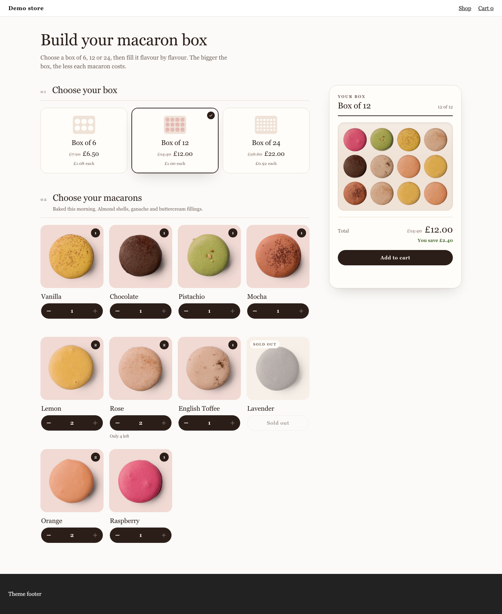
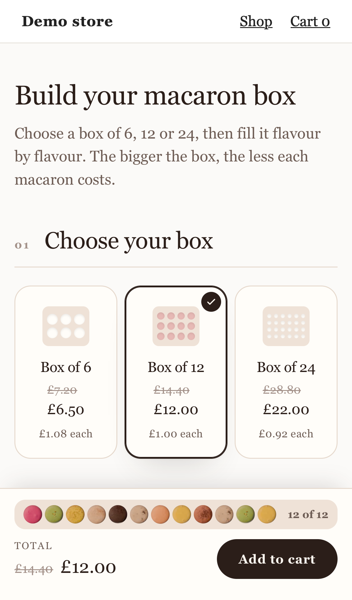
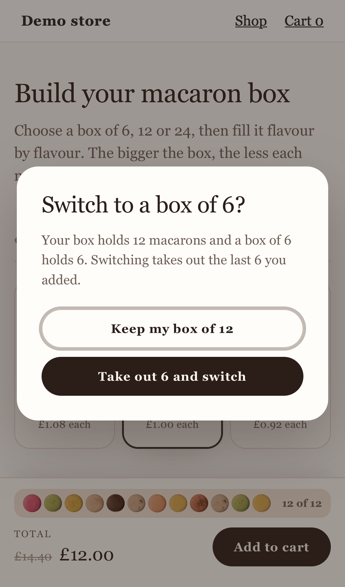
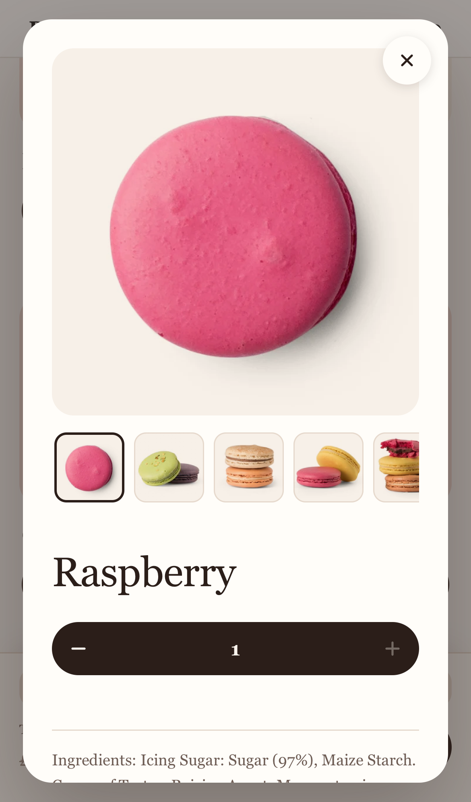

# Macaron Box

A "build your own box" where the box is the interface: the shopper picks a box size, then fills a tray of slots with real macaron photographs, one slot at a time.



<p>
  
  
  
</p>

It is a [Kitenzo](https://kitenzo.com) custom component: a React widget on the published `@kitenzo/react` SDK that ships to a Shopify theme as one JS file, one CSS file and a Liquid section. Kitenzo's engine owns selection, validation, pricing and the cart; this widget owns how the box looks and feels.

## What it shows

- **Box sizes read from the bundle, never typed in.** Several "equal to" count rules on one step (6, 12, 24) are alternatives. The SDK's `getSectionLimits` can only report them as a window (6 to 24), so `src/box.ts` reads the alternatives off the rules and draws one card per size. A bundle of 4 or 8 draws two cards. A bundle with no "equal to" rules draws none, and the widget renders without the size chooser.
- **Prices from the SDK.** Each card shows the box's price, the price before the discount and the price per macaron, computed with the SDK's `calculatePrice` on a box of that size, so a card always matches the total the cart will charge, in any currency.
- **A tray that fills in pick order.** One slot per macaron, filled with that flavour's photograph in the order the shopper chose. Tap a filled slot to take that macaron out: that slot empties, not the newest of its flavour.
- **No silent drops.** Switching to a smaller box than the tray holds opens a dialog that says how many would come out (the most recent) and lets the shopper keep their box instead.
- **"Fill the rest for me".** A pure, seeded planner (`src/autofill.ts`) fills only the empty slots, spreads them across flavours, never picks a sold-out flavour, never takes a flavour past its stock, and stops at an iteration cap. The plan is applied one `builder.addItem` at a time.
- **The buy button waits for the box the shopper chose.** Six macarons is a valid box to the engine, but not when the shopper is filling a box of 12. The button needs the SDK's `isSatisfied` and a full box.
- **Desktop and phone.** On desktop the tray sits in a sticky rail beside the flavours. On a phone it shrinks to a strip of dots in the sticky bar, which scrolls to the full tray when tapped.

## The bundle it expects

One step whose limit rules are several **Total number of products = N** rules, one per box size, and (optionally) a **tiered, set-price** discount with one "at least N" tier per size, its operator `max`. The demo bundle (`dev/catalog.ts`, id 2001):

| | |
|---|---|
| Step | "Choose your macarons": Vanilla, Chocolate, Pistachio, Mocha, Lemon, Rose, English Toffee, Lavender, Orange, Raspberry (real products and photographs from the Kitenzo demo store) |
| Count rules | `eq 6`, `eq 12`, `eq 24` |
| Discount | set price per tier: 6 for £6.50, 12 for £12.00, 24 for £22.00, operator `max` |
| Stock | Rose has 4 left; Lavender is sold out |

Why `max`: every tier is "at least N", so a box of 24 meets all three. `max` charges the largest tier value, £22.00, which is right because a bigger box always costs more in total. `cumulative` would add the tiers and charge £40.50. `test/box.test.ts` proves both against the SDK.

Other shapes it handles:

- **Any number of sizes** (`?bundle=2002` is a box of 4 or 8 at its own set prices).
- **No sizes at all** (`?bundle=2003` is "any 6 to 12" at 10% off): no size chooser, a tray of 12 slots, buyable from 6.
- **Bundle-wide `eq` rules** on a single-step bundle are read as sizes too. A size another rule rules out (an `eq 24` beside an `lte 12`) is not offered.
- **Percentage or money-off discounts**: the cards price the box filled with the cheapest flavour and say "From" when flavours cost different amounts.
- **More steps** render as plain flavour grids after the box, with their picks listed under the tray. **Required products** are listed as "Included".

It refuses (with a sentence for the shopper and the reason for the merchant in the theme editor) what every Kitenzo custom component refuses: rules that contradict each other, a box step with nothing in stock, a sold-out required product, and required personalisation it cannot collect.

## Edge cases, and where to see them

Run the dev server and add `?scenario=<id>` (comma-separate several), or use the dev toolbar.

| Edge case | How to see it |
|---|---|
| Sizes from the rules, not the code | default; `?bundle=2002` (two sizes); `?bundle=2003` (no size chooser) |
| Several `eq` rules are alternatives: 7 is inside the window but is no box | add 7 to a box of 12: the button stays refused until the box is full |
| A flavour with little stock stops at its stock and says why | default (Rose, 4 left); `?scenario=low-stock` (Vanilla, 2 left) |
| A sold-out flavour is shown and unpickable, or hidden | default (Lavender); `?scenario=hide-sold-out` |
| "Fill the rest" routes around sold-out and capped flavours | choose 12, add 3 Rose, press "Fill the rest for me" |
| Nothing can be sold | `?scenario=all-sold-out`, with `theme-editor` for the merchant's explanation |
| A smaller box asks before dropping picks | fill 9 of a box of 12, then choose the box of 6 |
| Prices in the shopper's currency | `?scenario=market-eur`, `?scenario=market-jpy` |
| Cart refusals as sentences | `?scenario=cart-422`, `cart-429`, `cart-500`, `cart-offline` |
| Basket Edit reopens the box it was bought in | add a box, then use the "Edit bundle" link on `/cart` |
| Bundle unpublished, API down, slow, never answers | `bundle-404`, `api-500`, `api-offline`, `slow-api`, `loading-forever` |
| Archived and draft products, hostile strings, contradictory rules, an empty bundle, a draft bundle | `archived-and-draft`, `hostile-strings`, `contradictory-rules`, `empty-bundle`, `draft-bundle` |
| A hostile theme (transformed ancestors, bare `button` rules, colliding class names) | `?theme=hostile`; the e2e suite runs every test under it |

## Run it

```bash
bun install
bunx vite --port 5181 --strictPort   # http://localhost:5181
bun run verify                       # typecheck, unit tests, theme asset build, e2e (desktop Chromium, iPhone 14 WebKit)
bun run screenshots                  # regenerate docs/screenshots (dev server running)
bun run package:embed                # the zip a merchant installs: assets, section, install guide
```

Install on a store with `theme/README.md` (the install guide) and `MERCHANT-SETUP.md` (what to set up in Kitenzo).

## How it works

- `src/box.ts`: the box as data. `boxSizes` reads the sizes off the `eq` rules; `boxOffers` prices each size with `calculatePrice` and the SDK's market localisation; `reconcileOrder` keeps the pick order beside the builder's quantities; `overflowOf` says which picks a smaller box would drop; `trayColumns` lays a tray out in full rows.
- `src/autofill.ts`: `planFill` and its seeded random source. Pure, so `test/autofill.test.ts` pins an exact plan to a seed.
- `src/selection.ts`: the SDK builder, seeded at creation, plus the pick-order tracker (subscribed to the builder, so a loop of adds is recorded in order), `box-full` as a reason one more cannot go in, and `fillCandidates` (what "Fill the rest" may choose from).
- `src/ui/Builder.tsx`: the chosen size, the switch confirmation, "Fill the rest", and the buy gate (`isSatisfied` and a full box).
- `src/ui/SizeChooser.tsx`, `src/ui/Tray.tsx`, `src/ui/SwitchDialog.tsx`, `src/ui/Summary.tsx`: the size cards, the tray and its phone strip, the "smaller box?" dialog, the rail and the sticky bar.
- `src/ui/ProductCard.tsx`, `src/ui/ProductDialog.tsx`: a flavour with its stepper, and its details with the six-photograph gallery.
- `dev/catalog.ts`: the three demo bundles. `theme/kitenzo-macaron-box.liquid`: the section, with every visible string a setting.
- `test/box.test.ts`, `test/autofill.test.ts`: the pure logic. `e2e/macaron-box.spec.ts`: this example's behaviour; `e2e/conformance.spec.ts`: what every Kitenzo custom component must do, on the built asset.

Everything else (config, content, money, the mount registry, the mock backend) is the starter's, unchanged in purpose; its comments explain the rules each part keeps.
