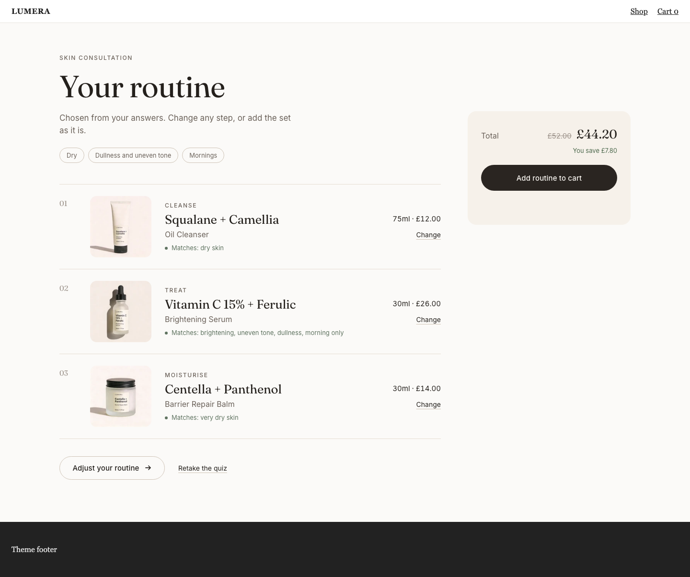
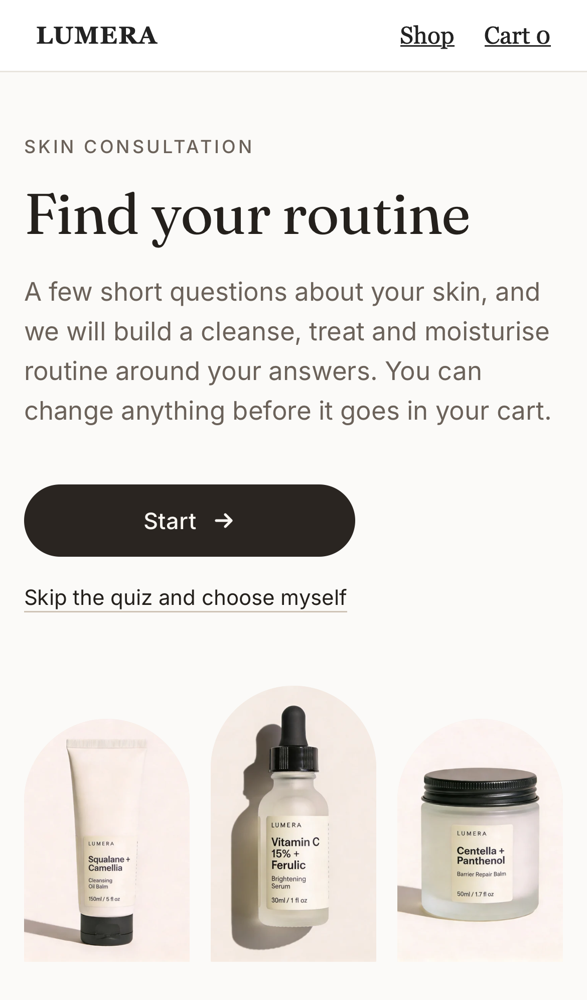
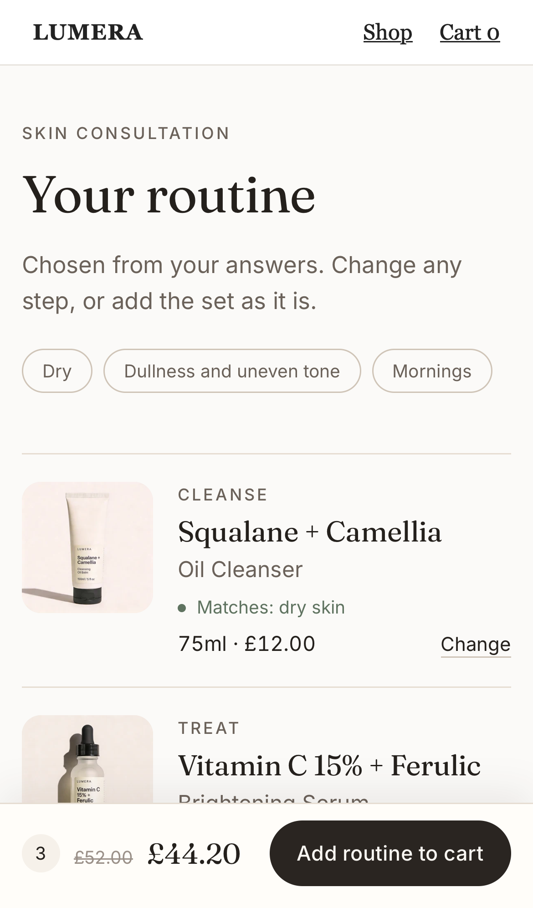
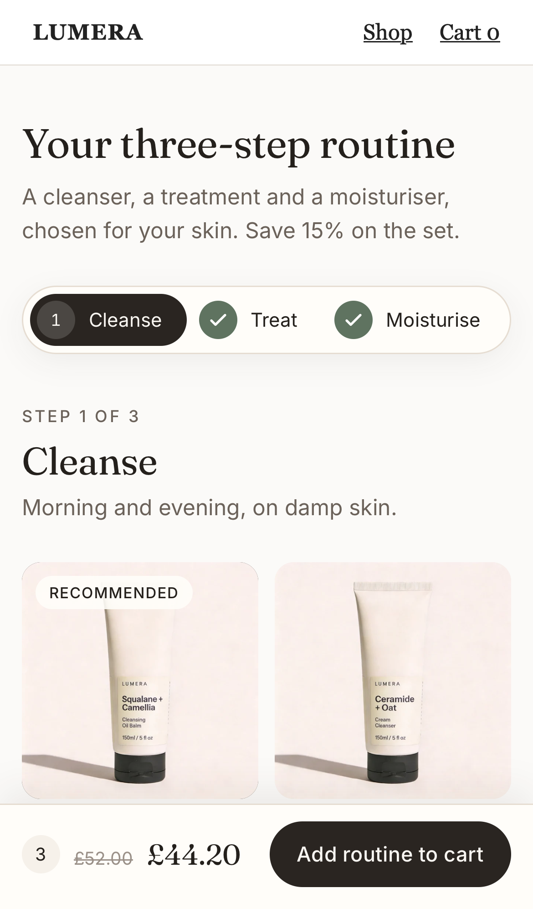

# Skincare Routine

A short skin quiz that builds the bundle for the shopper, then a step-by-step wizard to adjust it before it goes in the cart.



<p>
  
  
  
</p>

It is a [Kitenzo](https://kitenzo.com) custom component: a React widget on the published `@kitenzo/react` SDK that ships to a Shopify theme as one JS file, one CSS file and a Liquid section. Kitenzo's engine owns selection, validation, pricing and the cart; this widget owns the quiz, the wizard and how they look.

## What it shows

- **A builder seeded at creation from a computed selection.** The quiz's answers become a routine (`src/quiz.ts`), and the component that owns the SDK builder mounts only then, with the routine as its seed. The first paint of "Your routine" already holds it: there is no frame with an empty bundle, and no effect that fills one in. Retaking the quiz is a new builder, never a rewrite of the old one.
- **Answers map to product tags, and the mapping is a theme setting.** Each question is a section block (add, remove, reorder), and each answer lists the tags it matches. For every step, the routine takes the product that matches the most answers (ties keep the merchant's order), never a sold-out product or a sold-out size, and falls back to the first available product when nothing matches. A merchant with different tags rewires the quiz in the theme editor, without code.
- **A reason per product.** "Matches: dry skin, brightening" is the tags that matched, said as words. A fallback pick says "Our suggestion for this step" instead of claiming a match it did not find. In the wizard, other products that match the answers say so too, so swapping to another good fit is as easy as keeping the first.
- **A wizard that mirrors the merchant's settings.** One step on screen at a time, sticky step pills, Back and Continue. A step advances by itself only where the merchant turned on "advance when this step is done" (`autoNextSection`): here Cleanse and Treat do and Moisturise does not. Continue and any pill ahead of an unfinished step refuse, and say what the step still needs.
- **One-pick steps are choices.** A step whose rule is "exactly 1" swaps: choosing another product replaces the pick, through two builder calls, so the step can never hold more than its rule allows. Once a product is chosen its Size dropdown edits that line in place. A step that takes several products gets the starter's quantity stepper instead.
- **Option dropdowns with a sold-out value.** The cream cleanser's 75ml is sold out: it stays in the dropdown, disabled (`reachableOptionValues`), the card defaults to 150ml, and so does the quiz.
- **Skip and Edit.** "Skip the quiz" is on every quiz screen and opens an empty wizard. A basket Edit never shows the quiz: it opens the wizard with the saved routine, and adding it again replaces the one in the cart.

## The bundle it expects

Steps, each with a count rule, and product tags for the quiz to score. The demo bundle (`dev/catalog.ts`, id 2002), on real LUMERA products from the Kitenzo demo store:

| Step | Rule | Advance when done | Products |
|---|---|---|---|
| Cleanse | `eq 1` | on | Squalane + Camellia oil cleanser, Ceramide + Oat cream cleanser (75ml sold out here), PHA + Zinc exfoliating cleanser, Amino Acid gel cleanser; each in 75ml and 150ml |
| Treat | `eq 1` | on | Vitamin C + Ferulic, Retinal + Squalane (sold out on the store), Niacinamide + Zinc, Polyglutamic Acid + Beta-Glucan |
| Moisturise | `eq 1` | off | Centella + Panthenol balm, Hyaluronic + Aloe gel-cream, Squalane + Shea rich cream, Ceramide + Peptide daily moisturiser; each in 30ml and 50ml |

A flat 15% discount. The products carry their real Shopify tags (`dry-skin`, `oily-skin`, `combination-skin`, `sensitive-skin`, `all-skin-types`, `acne-prone`, `barrier-repair`, `brightening`, `anti-ageing`, `morning-only`, `evening-only`, ...).

Other shapes it handles:

- **Steps that take more than one product**: the quiz fills them up to the step's minimum with distinct products, and the wizard shows a stepper.
- **Optional steps** (no minimum): the quiz adds one product only when something in the step matches the answers.
- **Any number of questions, up to five, or none**: they are the section's blocks. With every block removed, the section opens on the wizard.
- **Required products** are listed as "Included" in the routine.

It refuses (with a sentence for the shopper and the reason for the merchant in the theme editor) what every Kitenzo custom component refuses: rules that contradict each other, a step with nothing in stock, a sold-out required product, and required personalisation it cannot collect.

## Edge cases, and where to see them

Run the dev server and add `?scenario=<id>` (comma-separate several), or use the dev toolbar.

| Edge case | How to see it |
|---|---|
| The quiz never recommends a sold-out product | answer Sensitive, Fine lines, Evenings: the retinal serum matches best and is sold out, so Treat gets the next best match |
| The quiz never seeds a sold-out size | answer Sensitive, Redness: the cream cleanser goes in at 150ml |
| Nothing matches: the fallback pick says so | in `dev/main.tsx`, add `questions: [{ title: 'Skin?', hint: '', answers: [{ label: 'Dry', tags: 'no-such-tag' }] }]` to `CONTENT`, then answer Dry; `e2e/skincare-routine.spec.ts` and `test/quiz.test.ts` cover it too |
| Auto-advance per step, as the merchant set it | "Skip the quiz", then choose a cleanser and a serum; the last step waits |
| A one-pick step swaps rather than overfills | choose a cleanser, go back, choose another |
| A sold-out size is disabled, not hidden | the Ceramide + Oat card's Size dropdown |
| Low stock says how many are left | `?scenario=low-stock` |
| A sold-out product is shown and unpickable, or hidden | default (the retinal serum, in Treat); `?scenario=hide-sold-out` |
| Nothing can be sold | `?scenario=all-sold-out`, with `theme-editor` for the merchant's explanation |
| Basket Edit skips the quiz and reopens the routine | add a routine, then use the "Edit bundle" link on `/cart` |
| Prices in the shopper's currency | `?scenario=market-eur`, `?scenario=market-jpy` |
| Cart refusals as sentences | `?scenario=cart-422`, `cart-429`, `cart-500`, `cart-offline` |
| Bundle unpublished, API down, slow, never answers | `bundle-404`, `api-500`, `api-offline`, `slow-api`, `loading-forever` |
| Archived and draft products, hostile strings, contradictory rules, an empty bundle, a draft bundle | `archived-and-draft`, `hostile-strings`, `contradictory-rules`, `empty-bundle`, `draft-bundle` |
| A hostile theme (transformed ancestors, bare `button` and `select` rules, colliding class names) | `?theme=hostile`; the e2e suite runs every test under it |

## Run it

```bash
bun install
bun run dev                 # http://localhost:5182
bun run verify              # typecheck, unit tests, theme asset build, e2e (desktop Chromium, iPhone 14 WebKit)
bun run screenshots         # regenerate docs/screenshots (dev server running)
bun run package:embed       # the zip a merchant installs: assets, section, install guide
```

Install on a store with `theme/README.md` (the install guide) and `MERCHANT-SETUP.md` (what to set up in Kitenzo, including the product tags).

## How it works

- `src/quiz.ts`: the quiz as data. `quizFrom` reads the questions and each answer's tags from the theme settings; `matchProduct` scores a product against the answers; `planRoutine` builds the routine per step from the step's own count, skipping anything sold out, with a marked fallback. Pure, and tested in `test/quiz.test.ts`.
- `src/ui/Builder.tsx`: the stage. The quiz, or a `<Routine>` keyed and mounted with its seed (the quiz's routine, nothing after "Skip", or the saved bundle on a basket Edit).
- `src/ui/Routine.tsx`: the builder (`useSelection`, seeded at creation), the cart, the review and the wizard, auto-advance from `autoNextSection`, and which steps can be opened yet.
- `src/ui/Quiz.tsx`, `src/ui/Review.tsx`, `src/ui/Wizard.tsx`: the consultation, "Your routine", and one step at a time with its pills and Back and Continue.
- `src/ui/usePick.ts`, `src/ui/PickControls.tsx`: a product's picker. In a one-pick step, "Choose" swaps and Size edits the chosen line in place.
- `src/selection.ts`: the starter's selection helpers plus `swapInStep`, `isStepFull` (for auto-advance) and `isStepMet` (for Continue).
- `src/content.ts`, `theme/kitenzo-skincare-routine.liquid`: every visible string as a section setting, and the quiz as "Question" blocks, each with its answers' tags. `test/theme.test.ts` checks the defaults match, renders the blocks' Liquid to JSON and checks the preset blocks are the default quiz.
- `dev/catalog.ts`: the demo routine. `e2e/skincare-routine.spec.ts`: this example's behaviour; `e2e/conformance.spec.ts`: what every Kitenzo custom component must do, on the built asset (where a starter check assumed a stepper, the equivalent check for this design replaces it, and says why).

Everything else (config, money, the mount registry, the mock backend) is the starter's, unchanged in purpose; its comments explain the rules each part keeps.
