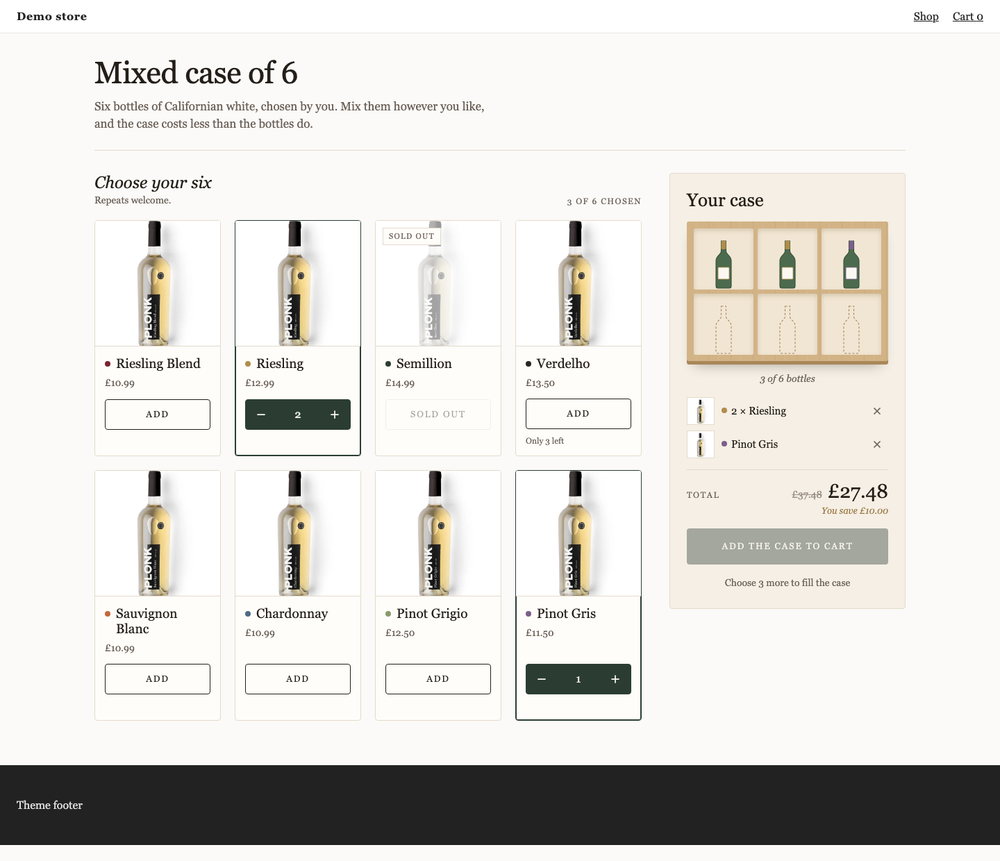
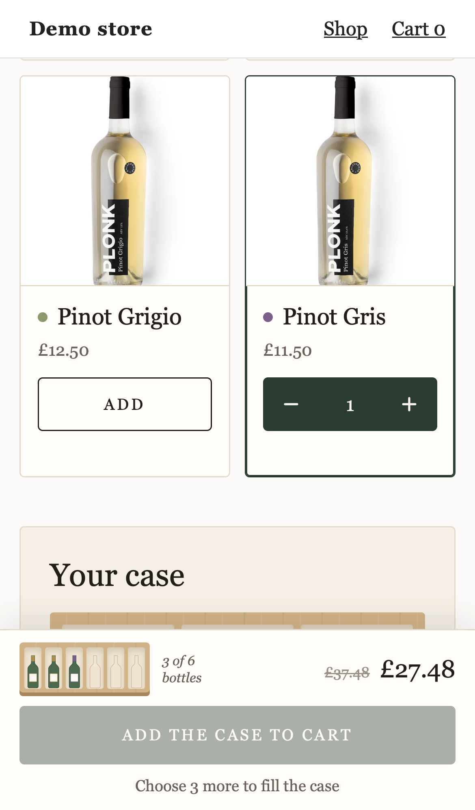
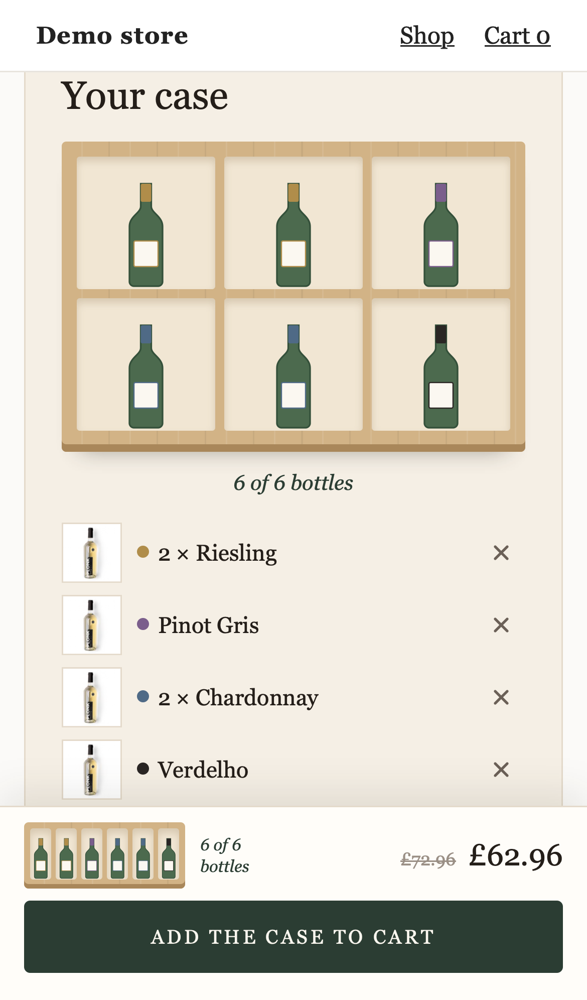

# Vanilla Core: a custom component with no framework

**The capability:** a Kitenzo bundle builder on `@kitenzo/core` alone, in plain TypeScript and DOM, with no React. The same engine, the same rules, the same cart: 26 kB of JavaScript over the wire instead of 72 kB.



It sells a mixed case of six Californian whites. The shopper fills a wooden case bottle by bottle; each wine wears a coloured foil so its bottles can be matched from the shelf to the case.

| | |
|---|---|
|  |  |

## Who it is for

A merchant whose theme already ships a lot of JavaScript, or an agency that wants the smallest asset it can put on a product page. Every other example in this repo bundles React, which is most of its 72 kB. This one does not, and shows what that costs you in code and what it does not cost you in behaviour.

## The size difference

Both built with `bun run build:embed` (Vite, minified IIFE); sizes in kB of 1000 bytes, gzip at level 9. `bun run size` prints this project's row and the breakdown.

| JavaScript | Raw | Gzip | Brotli |
|---|---:|---:|---:|
| `kitenzo-starter.js` (React, `@kitenzo/react`, core) | 223.9 kB | 71.8 kB | 63.5 kB |
| `kitenzo-vanilla-core.js` (core only) | 76.8 kB | **26.0 kB** | 23.3 kB |

64% less to download, parse and run, on every product page the section is on. Where the minified bytes come from:

| Source | Starter | Vanilla Core |
|---|---:|---:|
| `react-dom`, `react`, `scheduler` | 141.7 kB | none |
| `@kitenzo/react` | 10.0 kB | none |
| `@kitenzo/core` | 41.4 kB | 41.5 kB |
| The widget's own code | 27.9 kB | 32.6 kB |

The engine is the same 41 kB either way: that is what you are buying from Kitenzo, and it does not shrink. The widget's own code grew by 4.7 kB, which is the price of doing the hooks' jobs by hand (the cart flow, the edit loader, a 60-line DOM helper) plus the case graphic. The CSS is 4.1 kB gzipped here and 3.1 kB in the starter; the difference is the case.

The e2e suite holds the asset under a 30 KiB gzip budget and checks it carries no React (`e2e/vanilla-core.spec.ts`), so a stray dependency is caught before it ships.

## What core gives you

Everything that decides what is sold and for how much. None of it is reimplemented here.

| Job | `@kitenzo/core` | Used in |
|---|---|---|
| Load the bundle, the shop's settings, a saved case | `new KitenzoClient()`, `getBundle`, `getSettings`, `getSavedBundle` | `src/load.ts` |
| Hold the selection, validate it, notify on change | `createBundleBuilder`, `builder.subscribe`, `isSatisfied`, `errors`, `conditions` | `src/selection.ts`, `src/ui/builder.ts` |
| Pick counts for every step and the bundle | `getSectionLimits`, `getBundleLimits` | `src/model.ts` |
| Price the case, in the shopper's market | `calculatePriceWithConditions`, `resolvePresentmentPricing`, `resolveUpfrontFixedPrice`, `formatMoney`, `formatCurrency` | `src/money.ts` |
| Product options | `defaultOptionValues`, `resolveVariant`, `reachableOptionValues`, `selectOptionValue` | `src/ui/pick.ts` |
| Configure and add to the theme's cart, `_bundles` merged | `client.submitBundle`, `addBundleToCart`, `createAjaxCartOperations`, `AjaxCartError.shopperMessage` | `src/cart.ts` |
| Basket Edit | `readEditTarget`, `selectionsFromSaved`, `findEditedLines`, `hasOtherNativeInstance`, `withoutBundleDefinition` | `src/load.ts`, `src/cart.ts` |
| Descriptions as text | `htmlToPlainText` | `src/model.ts` |

## What you do yourself

What the React hooks did around those calls, and where it lives now.

- **Re-rendering.** `builder.subscribe(render)` replaces `useSyncExternalStore`. One `render()` patches every region in place (`src/ui/builder.ts`). Regions are built once, so the button under the shopper's finger is never replaced, and when "Add" turns into the stepper, focus moves to its + (`replaceKeepingFocus` in `src/dom.ts`). React would have kept the node; here you keep it.
- **Safe text.** `h()` and `setText()` in `src/dom.ts` put every outside string into a text node or an attribute. Nothing assigns `innerHTML`. JSX escaped for you; this file is what escapes for you now.
- **The client and its preview.** `<KitenzoProvider>` built the client and switched `preview` on in the theme editor, so a merchant can design against a draft. `createClient` in `src/load.ts` does both, after `keyProblem` has checked the key (the constructor throws on a bad one).
- **Loading.** `useBundle`, `useSettings` and `useBundleEdit` become `loadBundle` and `loadEdit` (`src/load.ts`), awaited once per mount. A settings failure is a sentence here; the provider swallowed it and the starter waited forever.
- **The cart flow.** `useBundleAjaxCart` becomes `createCartFlow` (`src/cart.ts`): the phases, one add at a time, recovery from a dropped connection, and replacing the edited case. Tested in `test/cart.test.ts`.
- **Lifecycle.** `mountWidget` returns `destroy()`, which the registry in `src/embed.ts` calls on section unload and bfcache restore. It unsubscribes from the builder, clears timers and closes the dialog. React's unmount did this for you.

## What you give up without @kitenzo/react

Read against the published 0.9.0 (`node_modules/@kitenzo/react/dist/index.js` in any project that installs it, such as `starter/`).

**A/B tests: nothing yet, in 0.9.0.** `useBundle` in 0.9.0 is `client.getBundle(id, { subscriptionId })` and three pieces of state (lines 82 to 117 of `dist/index.js`); there is no redirect, no visitor id and no impression anywhere in either package's `dist` (search them for `abTest`, `redirect`, `impression`: no hits). A widget on 0.9.0, React or not, takes no part in Kitenzo's A/B tests. That changes in the release after 0.9.0, which adds A/B testing to custom components by redirecting a shopper to their variant's page. In that release the work is split: core's client sends the visitor id and core's cart lines carry the attribution, so a core-only widget gets those for free; the redirect and the impression count are done by `useBundle`. When you upgrade, add them to `loadBundle`: after `getBundle`, if the bundle says to redirect, navigate and keep the loading state instead of rendering; once the case has rendered, record the impression when the bundle came back routed. Take the function names from that release's `index.d.ts`, not from here.

**The cart hook's phases: replicated.** `configuring`, `adding`, `attributes`, `added` and `failed` are in `src/cart.ts`, with the same meaning: only `added` means the lines and `_bundles` are both on the cart. What is not replicated is the hook's outcome object (`{ ok, reason, error }`) and its `onError(error, reason)` callback; `add()` resolves `true` or `false` and the state carries the shopper's sentence and the diagnostic `error`.

**`already-in-progress`: replicated, quietly.** A second press while an add is in flight is ignored (`inFlight` in `src/cart.ts`), and the button is `aria-disabled` and says "Adding…" meanwhile. The hook also returned a reason and a "Your cart is busy" sentence; this widget never needs it because the button cannot be pressed into that state.

**`cart-busy` and `hasMissingItems`: not applicable to a theme.** Both belong to the Storefront API cart (`useStorefrontBundleCart` in `@kitenzo/react/hydrogen`), whose cart can be mid-update when an add starts and can drop a line without an error. `/cart/add.js` adds every line or answers 422, so `useBundleAjaxCart` in 0.9.0 never reports `cart-busy` and always sets `hasMissingItems: false` (`dist/index.js`, in `reconcile`). If you take this widget headless, onto Hydrogen, you need both, and the React hook is the easier road.

**The rest of what React gave you.** StrictMode's double-render checks and React DevTools. Diffing: here, a region that forgets to update one attribute shows stale state, so every region updates everything it drew, and the e2e suite checks the contract attributes after every action. `useRecurringPlan` (recurring bundles), which this widget does not use either way; core has `validateRecurringChoice` and `recurringCartAttributes` if you need them.

## The bundle it expects

One step, exactly 6 (`dev/catalog.ts`): eight wines, repeats allowed, £10 off the case (a fixed discount), one wine sold out and one with only three left. The 6 is a rule on the step; a bundle-wide `eq 6` draws the same case.

Underneath, the widget is the starter's generic builder, so it renders any bundle: several steps, per-step and bundle-wide counts, required products, product options, sold-out and capped stock, conditions. The case picture sizes itself from the limits (`caseSize` in `src/model.ts`): a case of 6, 12 or 24 draws that many slots, and it steps aside for the plain list when nothing caps the count, when the count is over 24, or when the rules contradict each other. Like the starter, it refuses (with a message to the merchant in the theme editor) a bundle that needs personalisation, because it renders no inputs for it.

## Edge cases, and the scenario that shows each

Load the dev page with `?scenario=<id>` (several, comma separated), or use the toolbar.

| What happens | Scenario |
|---|---|
| The API is slow: a loading state the size of the widget | `slow-api`, `loading-forever` |
| The bundle was unpublished: "not available", never "refresh" | `bundle-404` |
| The API fails: a sentence, no status code | `api-500`, `api-offline` |
| The cart refuses a line: Shopify's own reason, as a sentence | `cart-422`, `cart-429`, `cart-500` |
| The connection drops on add: the selection holds, and the next press finishes that add, checking the cart before adding again | `cart-offline`, `cart-lost-response` |
| `/settings` fails: asked once more, then a sentence | `settings-error` |
| A shopper in another currency: every figure in it | `market-eur`, `market-jpy` |
| Sold-out wines shown and unpickable, or hidden by the shop's setting | default, `hide-sold-out`, `all-sold-out` |
| Archived and draft products | `archived-and-draft` |
| Titles with quotes, markup and right-to-left script render as text | `hostile-strings` |
| Rules that cannot be met: the merchant is told which | `contradictory-rules` with `theme-editor` |
| A draft bundle previews in the theme editor and cannot be bought | `draft-bundle` |
| A theme that styles bare elements and traps `position: fixed` | `?theme=hostile` (the e2e suite always runs on it) |
| Two sections on one page; the theme editor reloading the section | `?sections=2`; the toolbar's "reload section" |

Add a case to the cart, open the mock cart page, and follow its **Edit** link for the basket Edit round trip: the case comes back as it was, and adding it again replaces the original lines and their `_bundles` entry.

## Run it

```bash
bun install
bun run dev          # http://localhost:5187
bun run verify       # typecheck, unit, build, conformance + this example's e2e, desktop and mobile
bun run size         # the asset's weight, and where it comes from
bun run package:embed
```

## How it works

```
src/
  embed.ts          mounts on every [data-vanilla-core-bundle]; registry on window, section load/unload, bfcache
  widget.ts         one mount: checks the config, loads, renders a state or the builder, and can be destroyed
  load.ts           the client (preview in the theme editor), bundle + settings, the cart's Edit
  cart.ts           configure, add, _bundles, phases, lost-connection recovery, replacing an edited case
  model.ts          what is offered, what each step needs, what the merchant must fix, how big the case is
  selection.ts      the engine's builder, seeded at creation, plus "why not?" and "what is missing?"
  money.ts          the case's price and every amount, in the shopper's currency
  dom.ts            h(), setAttr(), setText(): the whole rendering layer, text-only by construction
  ui/builder.ts     the regions and the one render() that keeps them in step
  ui/pick.ts        one wine's option state and its add / stepper controls (card and dialog share it)
  ui/card.ts, ui/summary.ts, ui/dialog.ts, ui/notice.ts, ui/icons.ts (inline SVG, the bottle included)
  content.ts, config.ts, sdkFixes.ts, themeEditor.ts   as in the starter
  styles.css        tokens on the mount element, the theme-proof reset, the case
theme/kitenzo-vanilla-core.liquid   the section: bundle source first, every string a setting, theme fonts
e2e/conformance.spec.ts             the suite every component passes, adapted to a case of six
e2e/vanilla-core.spec.ts            the case, the hooks' jobs done by hand, the asset's size
test/cart.test.ts, load.test.ts, money.test.ts, model.test.ts, selection.test.ts
```

The colour tokens sit on the mount element at zero specificity (`:where([data-vanilla-core-bundle])`), so the section's accent and font settings, written on that same element, win and every element inherits them. The conformance suite checks they arrive.
