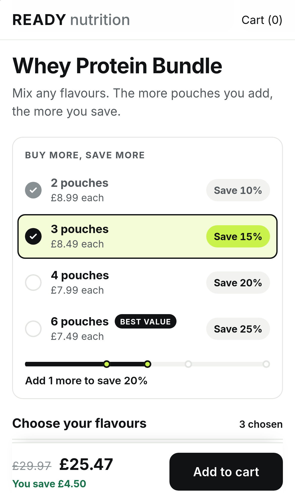
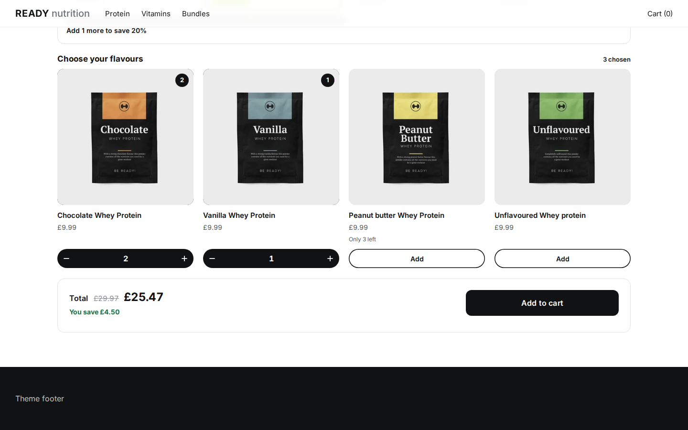

# Volume Ladder

A compact "buy more, save more" widget that sits in a product page's narrow right-hand column, next to the product photos, and adapts to the width of that column rather than the width of the screen.


| Phone (iPhone 14) | Grid layout, full width |
|---|---|
|  |  |

It shows three things:

- **Container queries.** The widget's root is a CSS container. Every layout rule asks how wide the widget is, never how wide the viewport is. At 1440px the widget is 460px wide, in a column beside the photos, and it lays itself out as it would on a phone. Give the same ladder a 900px container and it puts the products beside the ladder.
- **Two layouts from one asset.** The section's **Layout** setting is written to `data-layout` on the mount element. `ladder` (the default) is the compact column widget. `grid` is the same bundle as a full-width section, with the tiers laid out across the page as tiles. It is the same script, the same stylesheet and the same component tree. Only one class on the root differs.
- **Shopify Markets pricing.** Every amount is in the shopper's currency: unit prices, each ladder row's per-pouch price, the total, the compare-at price and the saving. Ladder rows are priced by the SDK for the selection each row stands for, so "4 pouches, ¥1,518 each" is what checkout will charge.

The ladder's rows are the bundle's discount tiers, read from the bundle by the SDK's `getDiscountLadder`. Nothing in the widget says "2 for 10%", and nothing in it works out what a tier gives. Change the tiers in Kitenzo and the rows change.

## The bundle it expects

The demo bundle (`dev/catalog.ts`, bundle 2006) is four whey protein flavours from the Kitenzo demo store:

- one step, `Choose your flavours`, with no rule of its own;
- a bundle-wide minimum of 2 and no maximum;
- a tiered **percentage** discount on the **number of products**: 2+ 10%, 3+ 15%, 4+ 20%, 6+ 25% (there is no tier at 5, on purpose);
- Peanut Butter has only 3 left, so its stepper stops below the top tier.

What it accepts, and how:

| Bundle shape | What the widget does |
|---|---|
| Tiers on the number of products (`gte`, `gt`, `eq`) | One ladder row per tier, lowest first. An `eq` tier is earned at its count only: one product later, the row whose discount applies again is the one highlighted. |
| Percentage tiers, combined by "best tier" (the default) or cumulative | Rows say "Save 15%": the percentage checkout gives at that count, added up for cumulative tiers. |
| Money-off tiers or set-price tiers | Rows show the amount saved, priced by the SDK, in the shopper's currency. |
| A tier with its own "reach the next tier" sentence, written in Kitenzo | That sentence is the progress line while the tier is the next one (`getDiscountTierText`). Tiers without one use the section's own copy. |
| Products at different prices, or a surcharge on some variants | Rows quote the cheapest product, surcharge counted, and drop the "each" price, which would not be exact. |
| A flat discount, or no discount | No ladder. The widget still sells the bundle, and the theme editor tells the merchant why the ladder is hidden. |
| Tiers on the bundle's value or on one product's quantity | Left out of the ladder (they cannot be said as "N pouches"), with a note in the theme editor. Checkout still applies them. Rows drop the "each" price: a row is priced for that many of one product, and such a tier can answer differently for the mix a shopper picks. |
| A tier above the bundle's maximum, or one that is not a step up | Left out, with a note in the theme editor naming the tier. |
| Several steps | The products render as one group per step. The ladder counts across the bundle. |
| Conditions that hide a product or a step | Hidden by the SDK's offer as the shopper picks; a step left with nothing to show is not drawn, and a hidden product is never the one a row is priced for. |
| Required products | Listed under the products as "Included", and counted on the ladder as checkout counts them: with one included pouch, one pick reaches the "2 pouches" row. Rows drop the "each" price, which would not be exact. |
| Required personalisation | Refused: the theme editor says to use a section that collects it. |

## Edge cases, and the scenario that shows each

Run the dev server and add `?scenario=<id>` (several, comma separated), or use the toolbar in the corner. Add `&layout=grid` to see any of them in the grid layout.

| Scenario | What you should see |
|---|---|
| (none) | The ladder in a product page's column, tiers derived from the bundle, Peanut Butter capped at 3 and saying "Only 3 left" (the **Low stock from** setting, 5 by default, 0 to never say it). |
| `market-eur`, `market-jpy` | Every amount in EUR or JPY (no decimals in JPY), ladder rows included. No £ anywhere. |
| `low-stock` | Chocolate has 2 left; the stepper stops and says why. |
| `all-sold-out` | Every flavour shown and unpickable; the buy button explains the bundle is not available. |
| `hide-sold-out` | The shop hides sold-out products. Combine with `all-sold-out`: the step is kept, visibly unpickable, rather than left empty. |
| `archived-and-draft` | An archived flavour is never offered; a draft follows the shop's setting. |
| `hostile-strings` | Quotes, markup and right-to-left titles render as text in the narrow rows without breaking the column. |
| `contradictory-rules` | The theme editor names the clashing rules; the storefront shows one neutral line. |
| `empty-bundle` | A sentence instead of an empty frame. |
| `slow-api`, `loading-forever` | A loading state, inside the column, at the widget's size. |
| `bundle-404`, `api-500`, `api-offline` | "Not available" for an unpublished bundle, "please refresh" only for our own failures. |
| `cart-422`, `cart-429`, `cart-500`, `cart-offline` | The cart's reason as a sentence under the button, never a status code. |
| `theme-editor` | Problems explained to the merchant, including why the ladder is hidden for a bundle with no count tiers. |
| `draft-bundle` | An unpublished bundle previews in the editor and cannot be added. |
| `?theme=hostile` | A theme with a transformed, container-typed ancestor and hostile bare-element rules. |
| `?sections=2` | Two sections on one page, each mounted once. |

## Run it

```bash
bun install
bun run dev            # http://localhost:5186, the ladder beside the product photos
                       # http://localhost:5186/?layout=grid, the full-width grid
bun run verify         # typecheck, unit tests, build the theme asset, e2e on desktop Chromium and mobile WebKit
bun run screenshots    # regenerate docs/screenshots (dev server running)
bun run package:embed  # the install kit for a merchant: assets, section, INSTALL.md, MERCHANT-SETUP.md
```

The end-to-end suite runs the conformance suite on **both layouts**: the ladder mounted in a product page's column, and the grid in a full-width section. `e2e/volume-ladder.spec.ts` adds this example's own checks: rows derived from the tiers, the climb from tier to tier, a tier's own sentence as the progress line, an included product counted on the ladder, the "each" price shown only when it is exact, the widget staying inside its 460px column at 1440 with no horizontal overflow, the layout following the container rather than the viewport, and every amount in the shopper's currency under `market-eur` and `market-jpy`.

## How it works

| File | What it does |
|---|---|
| `src/model.ts` | The SDK's offer as rendered (`getBundleOffer`, with what the conditions engine hides left out): each step's products, what is included, and what the merchant must fix, with photographs, plain-text descriptions and the ladder's notes added. |
| `src/ladder.ts` | Pure functions around the SDK's ladder. `ladderRungs` is the rows: one per tier (the count just past an "exactly N" tier is a rung of the ladder, but not a row). `candidatesOf`, `referencePick` and `rungSelection` choose the selection each row is priced for, going by a variant's price and its surcharge; `src/ui/Ladder.tsx` prices it, a selection the shopper has not made, with the SDK's `getBundlePrice`, which is what `useBundlePrice` returns for the total, so ladder rows and the total always agree. `hasOtherTiers` says when that price cannot be called the price of each product. `ladderNotes` tells the merchant about each tier the ladder leaves out. Unit tested in `test/ladder.test.ts`. |
| `src/ui/Ladder.tsx` | The rows, the progress bar and the progress line. Where the shopper stands is `getDiscountLadderProgress` on the count the engine sees; the line is the tier's own sentence (`getDiscountTierText`) or the section's copy. Rows are a list, not buttons: tapping "4 pouches" cannot choose four flavours for the shopper. |
| `src/selection.ts` | What the SDK's progress means for the page: how many are picked, and which missing count to say first. |
| `src/ui/Builder.tsx` | Owns the SDK's builder (`useBundleBuilder`) and the model, money (`useMoney`), the cart (`useBundleAjaxCart`) and the two layouts. The layout is one class on the root (`vol-root--ladder` or `vol-root--grid`). |
| `src/ui/context.ts` | Two contexts: what stays the same while the shopper picks, and the selection that does not. The ladder, the rows and the cards are memoised, so a render of the Builder that changed neither draws none of them again. |
| `src/ui/copy.ts` | Sentences built from the SDK's answers and the merchant's words (`blockedText`). |
| `src/ui/ProductItem.tsx` | A product as a compact row (ladder) or a card (grid), sharing one picker hook. |
| `src/ui/Summary.tsx` | The single buy panel: total, saving, button, status. It carries `cc-add-to-cart` and `cc-mobile-bar`, and on a phone it sticks to the bottom of the screen. |
| `src/styles.css` | `.vol-root` is a named container (`container: vol / inline-size`). Every layout change is `@container vol (...)`. Viewport media queries are used only for the sticky phone panel, the dialog and the page around the widget. Colour defaults sit on the mount element so the merchant's settings, set there by the Liquid, are not overridden. |
| `src/config.ts` | Reads `data-layout` (anything but `grid` is the ladder). |
| `src/content.ts` | The merchant's settings, read defensively, with defaults: every string, and the stock level from which a product says "Only 3 left". |
| `test/sdk-contract.test.ts` | The SDK behaviour the widget takes on trust: an included product counted on the ladder, the rung that ends an "exactly N" tier, a price for a selection nobody has made, in the shopper's currency. |
| `theme/kitenzo-volume-ladder.liquid` | The section. In the ladder layout it renders the product's own photos (`product.media`) beside the widget, so it can be a bundle product's main section; the grid layout is a page-width frame. |
| `dev/shell.ts` | The markup the Liquid renders around the mount element, shared by the dev page and the e2e harness, so both test the widget in the column it ships in. |
| `dev/catalog.ts` | The demo bundle. |

Everything else (the mount registry, content parsing, the mock backend, scenarios) is the starter's, unchanged in purpose. See `starter/` and `guides/` for why each rule exists.
