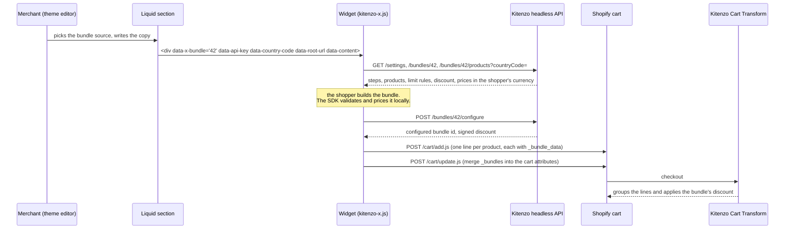

# How a custom component works

## The pieces

1. **The Liquid section** sits in the merchant's theme like any other section. It works out which bundle to show (by default, the bundle that the page's own product is), loads the theme's fonts, and renders one `
` carrying the bundle id, the API key, the shopper's country, the store's locale path, and every string the merchant has set, as JSON. It also loads the widget's two files from the theme's assets.
2. **The widget** mounts on that `
`. It reads the bundle through the SDK, which fetches the bundle, its products and the shop's settings, and merges them into one object. The shopper picks; the SDK's builder holds the selection and says whether it is valid; the SDK prices it locally, in the shopper's currency.
3. **Adding to the cart** is one SDK call, `useBundleAjaxCart().addToCart(bundle, selections)`. It asks Kitenzo to configure the bundle (which re-validates it and signs the discount), adds the lines to the theme's own cart, then writes the `_bundles` cart attribute. The order of those steps matters, and getting it wrong loses discounts on bundles already in the cart, which is why the widget never does it by hand.
4. **At checkout**, Kitenzo's Cart Transform reads `_bundles`, groups the lines back into a bundle and applies the discount. The merchant's order shows each product as a line of one bundle.

## What lives where

| Concern | Owner | Where you see it |
|---|---|---|
| What can be picked, how many, from which step | the bundle, in Kitenzo | `limitRules`, read with `getSectionLimits` / `getBundleLimits` |
| Whether a selection can be bought | the SDK | `isSatisfied` on the builder's state |
| What it costs, in which currency | the SDK | `useBundlePrice` |
| Cart lines and the `_bundles` attribute | the SDK | `useBundleAjaxCart` |
| The discount at checkout | Kitenzo's Cart Transform | nothing to do |
| Sold-out and draft products, how options read | the shop's settings in Kitenzo | `useSettings()` |
| Every word on screen, colours | the merchant, in the theme editor | the section's settings, `data-content` |
| Fonts | the merchant's theme | loaded by the section, `--x-font-*` |
| Layout, interaction, design | you | the widget |

## Modes

Kitenzo Headless has two modes. **Mode 1** embeds Kitenzo's own builder, configured in the admin, with no code. **Mode 2**, which is what this repo is about, uses the SDK's hooks to drive an interface you build. Both talk to the same API with the same key, and a store can use both on different pages. See https://headless.kitenzo.com for Mode 1 and for the API reference.

## Why it ships as theme assets

A custom component lives inside a normal Shopify theme, so it inherits everything the store already has: its header and footer, its cart and cart drawer, its apps, its analytics, its SEO, its checkout. Nothing extra is hosted. Updating the widget is uploading two files. The trade-off is that it shares a page with a theme it does not control, which is why so much of [best-practices.md](best-practices.md) is about surviving one.

## Bundle types

The API serves three. A custom component should branch on what the SDK tells it, not assume:

- **`native`**: each picked product is its own cart line, grouped at checkout by the Cart Transform. The common case, and what every example here uses.
- **`multiple-products`**: one "ghost" cart line stands for the bundle, with its contents written as line properties.
- **`single-product`**: a product with a fixed set of options.

`useBundleAjaxCart` handles all three; the difference matters only if you read the cart back yourself.
