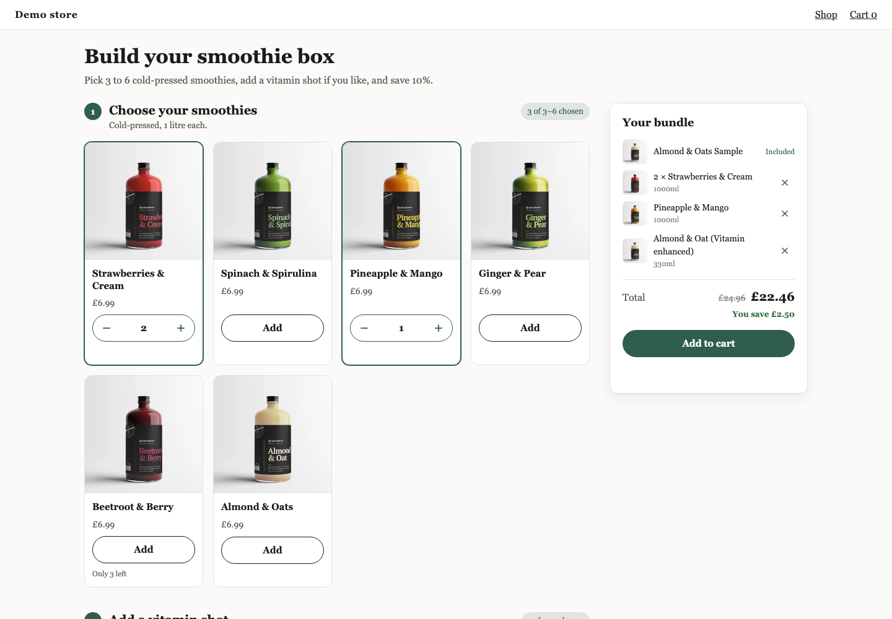

# Kitenzo custom component: starter

A complete, generic custom component. It renders **any** Kitenzo bundle (one step or many, counts per step or across the bundle, required products, product options, sold-out and capped stock, conditions), adds it to a Shopify theme's own cart, and ships as two theme assets and a Liquid section. Copy it, rename it, and make it look like your merchant's brand.



## Start

```bash
npx degit kitenzo/custom-components/starter my-component   # or copy this folder
cd my-component
bun install
bun run rename -- --slug acme-tea --prefix act --brand "Acme Tea"
bun run dev
```

Open http://localhost:5173. You need [Bun](https://bun.sh) 1.3 or later.

The dev page is a stand-in for a theme page. The widget on it is real: it runs the published SDK against a mock of the Kitenzo API and Shopify's cart, on real products from the Kitenzo demo store. Add a bundle to the cart, then open the cart page to see exactly what reached Shopify, and follow its **Edit** link to see the basket Edit round trip. The toolbar (bottom left) switches on the [edge cases](../guides/edge-cases.md): a slow or failing API, an unpublished bundle, a cart that refuses a line, a shopper in Germany or Japan, the theme editor, a hostile theme, two sections on one page.

## Commands

| | |
|---|---|
| `bun run dev` | the dev page on the mock backend |
| `bun run typecheck` | |
| `bun run test` | unit tests (vitest) |
| `bun run test:e2e` | builds the asset, then the conformance suite on it: hostile theme, desktop Chromium and mobile WebKit |
| `bun run verify` | all of the above |
| `bun run build:embed` | `dist-embed/kitenzo-starter.js` and `.css`: the widget |
| `bun run package:embed` | the install kit zip for the merchant |
| `bun run rename -- --slug … --prefix … --brand …` | rename every identifier a theme sees |
| `bun run snapshot [-- --store x.myshopify.com]` | refresh the product snapshot from a store's public catalogue |

## Make it yours

1. **Rename** (above). Choose the three names once: a shipped section's file name and setting ids are what the merchant's templates point at.
2. **Your bundle.** Describe its shape in `dev/catalog.ts` (steps, rules, discount) and run `bun run snapshot -- --store <their-store>.myshopify.com` to pull their real products.
3. **Your design.** Tokens at the top of `src/styles.css`; components in `src/ui/`. The logic (`model.ts`, `selection.ts`, `money.ts`) rarely needs to change.
4. **Your words.** Every string the shopper sees is a section setting: add new ones to `src/content.ts` and `theme/kitenzo-starter.liquid` together (a test checks they agree).
5. **Prove it**: `bun run verify`, then look at it at 1440 and 390 wide in every state.
6. **Ship it**: `bun run package:embed`, and update `theme/README.md` (the merchant's install guide) and `MERCHANT-SETUP.md`.

## How it is put together

```
src/
  embed.tsx         mounts on every [data-starter-bundle]; survives two sections, the theme editor, bfcache
  App.tsx           checks the config, loads the bundle, answers the cart's Edit
  config.ts         what a mount element says: bundle, key, country, locale path
  content.ts        the merchant's copy, read defensively, with defaults
  model.ts          the bundle as rendered: what is offered, what each step needs, what the merchant must fix
  selection.ts      the SDK's builder, seeded at creation, plus "why not?" and "what is missing?"
  money.ts          every amount, in the shopper's currency
  sdkFixes.ts       data fixes for known SDK issues, each with a test that says when to delete it
  ui/               Builder, ProductCard, PickControls, ProductDialog, Summary, Notice
  styles.css        tokens, the theme-proof reset, components
theme/
  kitenzo-starter.liquid   the section: bundle source, every setting, theme fonts, the mount element
  README.md                the merchant's install guide (INSTALL.md in the kit)
dev/                       never shipped
  catalog.ts               the demo bundle
  mock/                    the mock API and cart, the scenarios, the catalogue builder
  page.ts, main.tsx        the dev page; toolbar.ts, cart.html
test/                      unit tests
e2e/                       the conformance suite and its harness
```

## Learn more

- [How it works](../guides/how-it-works.md), [the contract](../guides/the-contract.md), [best practices](../guides/best-practices.md), [edge cases](../guides/edge-cases.md), [testing](../guides/testing.md), [shipping](../guides/shipping.md)
- The SDK: https://headless.kitenzo.com, and the type definitions in `node_modules/@kitenzo/*/dist/index.d.ts`, which are thoroughly documented.
- Working with a coding agent: [AGENTS.md](AGENTS.md).
